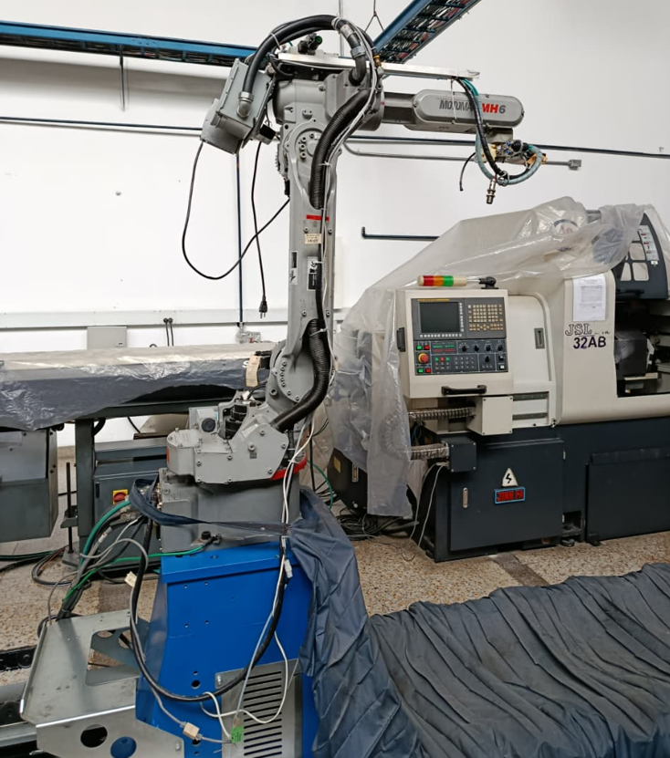
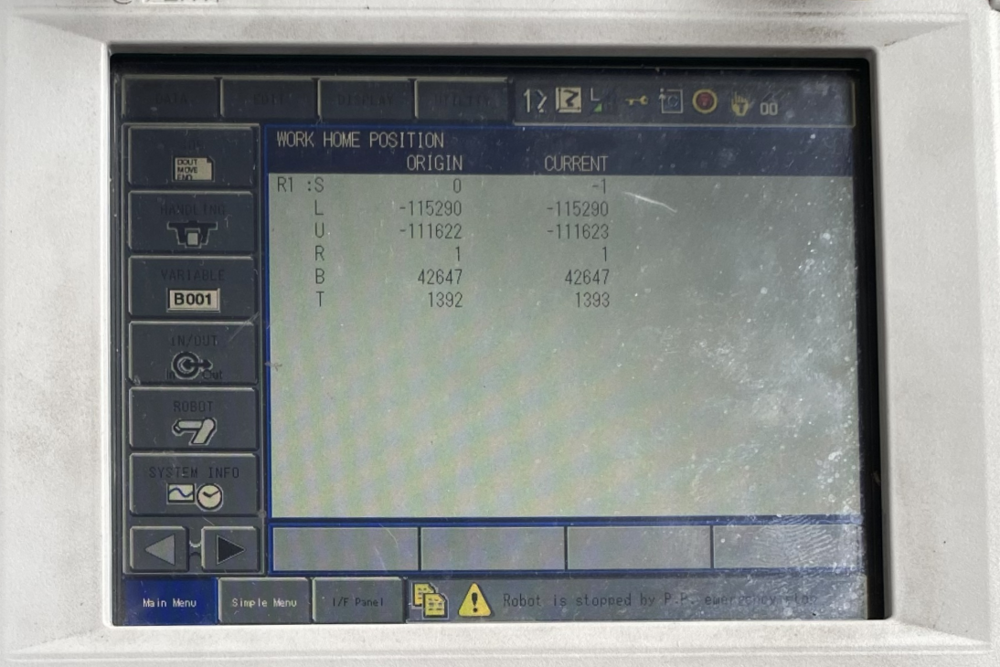
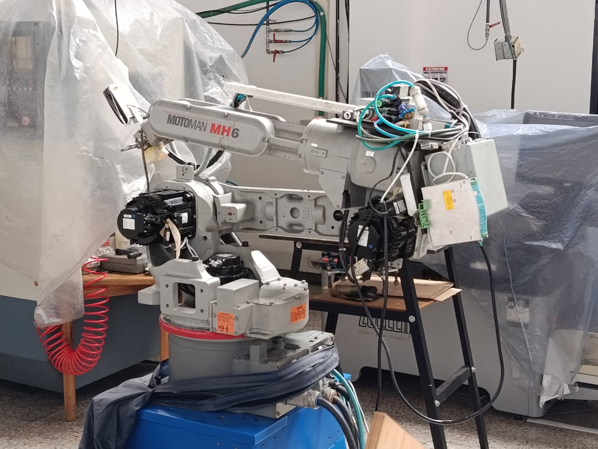
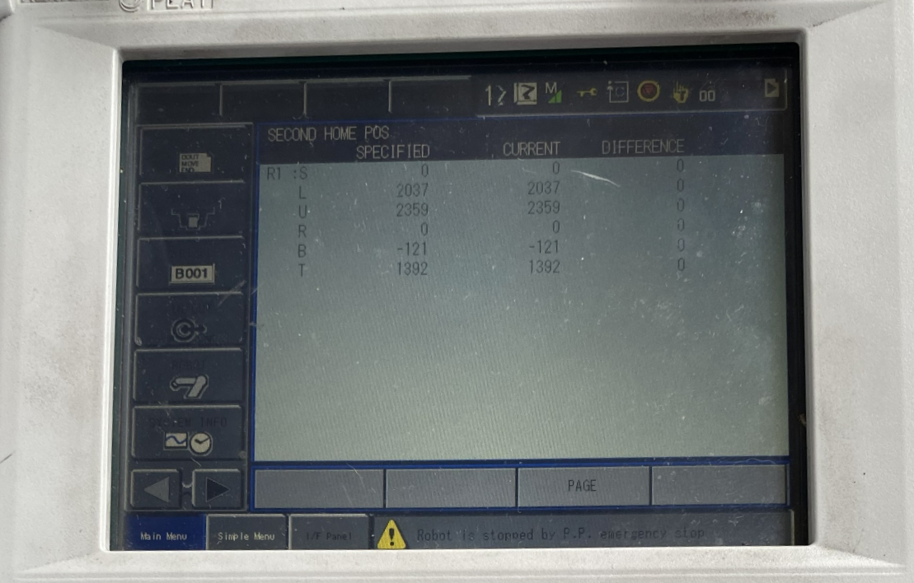
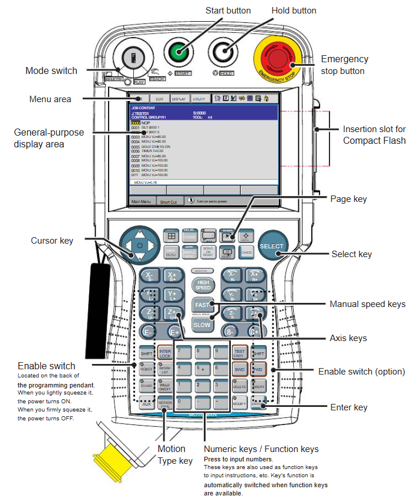
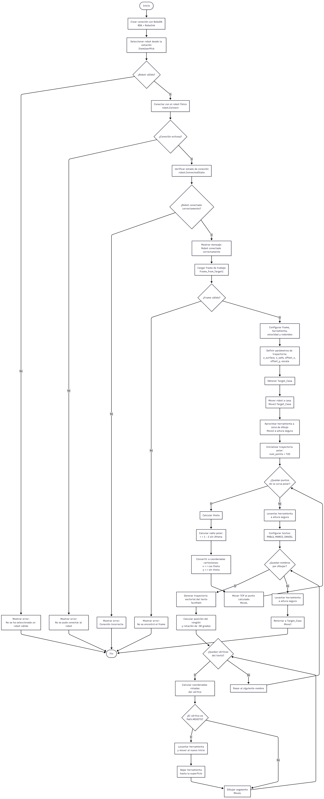

<div align="center">
  <picture>
    <source srcset="https://imgur.com/5bYAzsb.png" media="(prefers-color-scheme: dark)">
    <source srcset="https://imgur.com/Os03JoE.png" media="(prefers-color-scheme: light)">
    
  </picture>

  <h1>Laboratorio No. 02 Robótica Industrial - Análisis y Operación del Manipulador Motoman MH6.</h1>
</div>

---

## Solución planteada:

En este segundo laboratorio de robótica industrial se trabajó con el manipulador **Motoman MH6** del fabricante *Yaskawa*, instalado en la Sala CAM,el cual dispone de dos ejes adicionales asociados a la estación, ampliando de esta manera las posibilidades de operación sin cambiar la estructura principal del robot. Para el caso de este laboratorio se busca no solo comprender las caracteristicas tecnicas de este robot, sino también su modo de operación, posiciones iniciales y la forma en que puede ser controlado mediante el software ***RoboDK***. 

Ahora bien, el trabajo que se describe a continuacion, parte de una comparativa entre este manipulador y el con manipulador **ABB IRB 140** usado en la practica anterior, considerando aspectos como alcance, carga útil, repetibilidad, velocidades articulares, aplicaciones y entorno de programación. Lo anterior con el fin de que, si bien los dos son manipuladores industriales de seis ejes, cada uno responde a necesidades distintas dentro de una celda de trabajo.

Luego de ello, se aborda la operación manual del manipulador, incluyendo movimientos por articulaciones, desplazamientos cartesianos, traslaciones y rotaciones respecto a los ejes de referencia, sesion importante, dado que permite reconocer cómo responde el robot desde el *teach pendant* y cómo controlar mejor el TCP durante la enseñanza de puntos.

Finalmente, se utiliza el software **RoboDK** para crear la estación virtual, simular movimientos y generar una trayectoria polar que después pueda ejecutarse en el manipulador físico, esto ultimo con el proposito de conectar la comparación técnica, la operación manual y la programación de trayectorias en un mismo proceso práctico.

---

## Comparación técnica entre el Motoman MH6 y el ABB IRB140

A continuación se presenta un cuadro comparativo entre el manipulador **Motoman MH6** y el **ABB IRB140**, considerando sus características técnicas principales.

| Característica | Motoman MH6 | ABB IRB140 |
|---|---|---|
| Fabricante | Yaskawa Motoman | ABB Robotics |
| Tipo de robot | Manipulador industrial articulado | Manipulador industrial articulado |
| Número de ejes | 8 ejes | 6 ejes |
| Carga útil máxima | 6 kg | 6 kg |
| Alcance máximo aproximado | 1422 mm | 810 mm |
| Repetibilidad | ±0.08 mm | ±0.03 mm |
| Masa aproximada | 130 kg | 98 kg |
| Montaje | Piso, pared o techo | Piso, pared o invertido |
| Controlador asociado | DX100 / controlador Motoman | IRC5 |
| Software trabajado | RoboDK | RobotStudio |
| Aplicaciones típicas | Manipulación, ensamble, empaque, dispensado, soldadura y atención de máquinas | Manipulación, ensamble, manufactura flexible, soldadura, limpieza, empaque y automatización industrial |

---

### Velocidades y rangos de movimiento del Motoman MH6

En el manipulador Motoman MH6, cada articulación posee un rango de movimiento y una velocidad máxima específica. Estos parámetros son importantes porque determinan la capacidad del robot para ejecutar movimientos rápidos, alcanzar distintas zonas del espacio de trabajo y evitar configuraciones no deseadas durante la programación.

| Eje | Velocidad máxima aproximada | Rango de movimiento aproximado |
|---|---|---|
| `S` | 220 °/s | ±170° |
| `L` | 200 °/s | +155° / -90° |
| `U` | 220 °/s | +250° / -175° |
| `R` | 410 °/s | ±180° |
| `B` | 410 °/s | +225° / -45° |
| `T` | 610 °/s | ±360° |

Los ejes `S`, `L` y `U` corresponden principalmente al posicionamiento general del brazo, mientras que los ejes `R`, `B` y `T` están asociados a la orientación de la muñeca y de la herramienta. Por esta razón, los últimos ejes suelen presentar velocidades mayores, ya que permiten ajustar rápidamente la orientación del efector final.

---

### Velocidades del ABB IRB140

Para el caso del ABB IRB140, las velocidades articulares aproximadas son las siguientes:

| Eje | Velocidad máxima aproximada |
|---|---|
| Eje 1 | 200 °/s |
| Eje 2 | 200 °/s |
| Eje 3 | 260 °/s |
| Eje 4 | 360 °/s |
| Eje 5 | 360 °/s |
| Eje 6 | 450 °/s |

---

### Análisis comparativo de los manipuladores

A partir de las características revisadas, ambos robots se pueden entender como manipuladores industriales de seis grados de libertad, donde aunque su aplicación no es exactamente la misma, comparten una carga útil nominal similar, pero cambian bastante en alcance, tamaño de celda y entorno de programación.

En este sentido, el **Motoman MH6** destaca por su mayor alcance, cercano a 1422 mm, lo que le permite cubrir una zona de trabajo más amplia sin mover la base, permitiendo asi ser conveniente para trayectorias largas, manipulación de piezas, empaque, dispensado o atención de máquinas. Ademas de ello, como se menciona al inicio, el Motoman instalado en el laboratorio cuenta con dos ejes adicionales, un eje traslacional, sobre el cual reposa el manipulador y se mueve mediante un Riel y un eje externo rotacional con el fin de que la pieza siempre quede en una posicion conveniente para el manipulador, lo que amplía un poco las posibilidades de operación.

Ahora bien, el **ABB IRB140**, en cambio, es más compacto, con un alcance aproximado de 810 mm, funcionando mejor en celdas pequeñas o espacios reducidos; ademas de ello, tiene la ventaja de contar con un ecosistema bastante solido, *RobotStudio*, lo que facilita la simulación y programación cuando de trabajar con esta marca se refiere. 

En términos prácticos, el Motoman ofrece mayor cobertura espacial, mientras que el ABB resulta más cómodo para estaciones compactas y trabajos dentro del entorno ABB.

---

## Configuraciones iniciales del Motoman MH6

Durante la operación del manipulador **Motoman MH6** se identificaron dos posiciones de referencia principales, conocidas como ***Home 1*** y ***Home 2***. Configuraciones que permiten llevar el robot a unas posturas conocidas antes de iniciar una rutina, con el fin de verificar el estado de los ejes o dejar el manipulador en una posición segura cuando no se está ejecutando una trayectoria.

Estas posiciones las podemos observar mendiante el *teach pendant*, donde cada articulación del manipulador es identificada con `S`, `L`, `U`, `R`, `B` y `T`, donde los valores frente a las mismas permite conocer la posición interna registrada por el controlador para cada eje, sirviendo como referencia para comparar si el robot se encuentra correctamente ubicado en la posición de Home seleccionada.

### Configuración `Home 1`

La configuración **Home 1** corresponde a una posición de referencia general del manipulador, en la pantalla del *teach pendant* aparece como **WORK HOME POSITION**, mostrando los valores de origen y la posición actual de cada eje. 

| Articulación | Posición en Home 1 |
|---|---|
| `S` | `0` |
| `L` | `-115290` |
| `U` | `-111622` |
| `R` | `1` |
| `B` | `42647` |
| `T` | `1393` |

<div align="center">
  
</div>

<div align="center">
  
</div>
En el caso de esta ultima imagen, la posición actual del robot prácticamente coincide con los valores definidos para esta configuración, con diferencias muy pequeñas en algunos ejes, lo cual indica que el manipulador se encontraba correctamente ubicado en dicha posición.

### Configuración `Home 2`

La configuración **Home 2** corresponde a una segunda posición de referencia del manipulador. En la pantalla aparece como **SECOND HOME POS**, donde se muestran los valores especificados, actuales y la diferencia entre ambos. 

| Articulación | Posición en Home 2 |
|---|---|
| `S` | `0` |
| `L` | `2037` |
| `U` | `2359` |
| `R` | `0` |
| `B` | `-121` |
| `T` | `1392` |

<div align="center">
  
</div>

<div align="center">
  
</div>
En la imagen se observa que la diferencia es igual a cero en todos los ejes, lo que indica que el robot se encuentra exactamente en la posición definida como segundo Home.

### Comparación entre `Home 1` y `Home 2`

Al revisar ambas posiciones, se nota que **Home 1** y **Home 2** cumplen funciones distintas dentro de la operación. **Home 1**, al aparecer como `WORK HOME POSITION`, se puede asociar más con una posición de trabajo o referencia operativa de la celda. En cambio, **Home 2**, identificada como `SECOND HOME POS`, funciona mejor como una posición auxiliar, más ordenada para verificación, reposo o traslado seguro dentro del procedimiento.

Para la práctica, **Home 2** puede considerarse más conveniente como posición segura inicial, ya que en la pantalla se observa que la diferencia entre la posición especificada y la actual es cero en todos los ejes. Sin embargo, si la rutina necesita iniciar cerca de la zona de operación, **Home 1** puede resultar más útil porque está más relacionada con la posición de trabajo definida para la celda.

## Movimiento manual del manipulador Motoman MH6

Durante la práctica, el movimiento manual del **Motoman MH6** se realizó desde el *teach pendant* del controlador *DX100*. Esta parte es clave porque antes de ejecutar cualquier rutina desde RoboDK o desde un programa cargado en el controlador, primero hay que entender cómo responde el manipulador cuando se mueve directamente desde el mando. En términos prácticos, aquí se aprende a controlar el robot en modo seguro, revisar su postura, ubicar el TCP y validar que no existan interferencias dentro de la celda.

El *teach pendant* concentra los elementos principales de operación: el selector de modo `TEACH / PLAY / REMOTE`, los botones `START`, `HOLD` y `EMERGENCY STOP`, las teclas de coordenadas, las teclas de velocidad manual, las teclas de movimiento por eje, el botón `SERVO ON READY` y el `Enable Switch`, ubicado en la parte posterior del mando. Este último es importante porque permite habilitar el movimiento del robot mientras se opera manualmente; si no se presiona correctamente, el manipulador no se desplaza aunque se presionen las teclas de eje.

<div align="center">
  
</div>

### Movimiento por articulaciones

En el modo por articulaciones, el robot se mueve eje por eje. Para el **Motoman MH6**, las articulaciones principales se identifican como `S`, `L`, `U`, `R`, `B` y `T`. Los ejes `S`, `L` y `U` están más relacionados con el posicionamiento general del brazo, mientras que `R`, `B` y `T` corresponden principalmente a la orientación de la muñeca y de la herramienta.

Para mover el manipulador de esta manera, primero se coloca el selector del pendant en modo `TEACH`. Luego se verifica que el grupo de control activo corresponda al robot, en este caso `R1`, ya que el laboratorio también cuenta con ejes adicionales asociados a la estación. Después se selecciona el sistema de coordenadas mediante la tecla `[COORD]` hasta llegar al modo de articulaciones o `Joint`. Con el robot en este modo, las teclas de eje permiten mover cada articulación en sentido positivo o negativo.

En la botonera se observa que las teclas están organizadas de manera que una misma tecla sirve para el modo articular y para el modo cartesiano. Por ejemplo, cuando se trabaja por articulaciones, las teclas controlan `S- / S+`, `L- / L+`, `U- / U+`, `R- / R+`, `B- / B+` y `T- / T+`. Ya en operación, después de liberar el paro de emergencia si estaba activo, se presiona `[SERVO ON READY]`, se sostiene el `Enable Switch` y se oprime la tecla del eje que se desea mover. Naturalmente, esto se hace con una velocidad baja al principio, porque cualquier cambio brusco puede acercar la herramienta a una zona no deseada.

Ahora bien, como se mencionó, el Motoman cuenta con 2 ejes adicionales, el rotacional externo y el traslacional, los cuales son controlados mediante las teclas `E- / E+` y `8- / 8+` respectivamente. 


### Movimiento cartesiano

En el modo cartesiano, el movimiento ya no se interpreta como giro independiente de cada articulación, sino como desplazamiento del TCP respecto a un sistema de referencia. Esto resulta mucho más cómodo cuando se quiere aproximar la herramienta a una superficie, seguir una dirección específica o corregir la posición del efector final sin pensar directamente en cada junta del robot.

Para cambiar a este modo, se utiliza nuevamente la tecla `[COORD]`. Según el funcionamiento del DX100, cada pulsación cambia el sistema de coordenadas en el orden `Joint`, `Cartesian/Cylindrical`, `Tool` y `User`. El modo activo se revisa en la zona superior de la pantalla, dentro del área de estado del *teach pendant*. Una vez seleccionado el modo cartesiano, las mismas teclas de movimiento pasan a controlar traslaciones y rotaciones del TCP.

En este caso, las teclas marcadas como `X- / X+`, `Y- / Y+` y `Z- / Z+` permiten mover la herramienta linealmente sobre los ejes cartesianos. Las teclas asociadas a `R`, `B` y `T` se usan para modificar la orientación de la herramienta, que en la práctica se interpreta como rotación alrededor de los ejes del sistema de referencia seleccionado. Esta diferencia es importante porque en modo articular se modifica la postura del robot, mientras que en modo cartesiano se busca controlar mejor el comportamiento espacial del TCP.

### Traslaciones en `X`, `Y` y `Z`

Las traslaciones se usan cuando se necesita desplazar la herramienta sin cambiar demasiado su orientación. En el laboratorio esto sirve para acercar el TCP a la zona de trabajo, corregir la altura respecto a la superficie y ubicar el punto inicial de una trayectoria. Para mover en `X`, `Y` o `Z`, se selecciona el modo cartesiano con `[COORD]`, se activa el servo, se mantiene presionado el `Enable Switch` y luego se presiona la tecla correspondiente a la dirección deseada.

El movimiento en `X` desplaza el TCP hacia el sentido positivo o negativo de ese eje, el movimiento en `Y` corrige la posición lateral según el sistema activo, y el movimiento en `Z` normalmente se usa para subir o bajar la herramienta respecto a la superficie de trabajo. Esta última dirección fue especialmente importante para evitar que la herramienta golpeara la mesa o el material antes de iniciar la trayectoria.

### Rotaciones alrededor de `X`, `Y` y `Z`

Las rotaciones permiten ajustar la orientación del TCP. En una práctica como esta, donde se trabaja con una trayectoria sobre una superficie, no basta con llegar a un punto; también importa cómo llega la herramienta. Una orientación incorrecta puede hacer que el marcador, punta o herramienta de trazado no contacte bien la superficie, o que llegue con un ángulo poco conveniente.

Desde el *teach pendant*, estas rotaciones se realizan usando las teclas asociadas a la muñeca del robot cuando se está en un sistema cartesiano, de herramienta o de usuario. En términos operativos, el usuario selecciona el sistema con `[COORD]`, mantiene habilitado el robot con el `Enable Switch` y utiliza las teclas correspondientes para orientar la herramienta alrededor de los ejes definidos. En el laboratorio, esta operación se entiende más como un ajuste fino de orientación que como un desplazamiento grande del manipulador.

---

## Control de velocidad para movimientos manuales

El control de velocidad manual es uno de los puntos más importantes cuando se opera el Motoman desde el *teach pendant*. En el DX100, la velocidad manual se cambia con las teclas `[FAST]` y `[SLOW]`, ubicadas en la zona central del mando. Según el manual del controlador, al presionar `[FAST]` la velocidad cambia en el orden `INCH`, `SLOW`, `MED` y `FAST`; al presionar `[SLOW]`, el cambio se hace en sentido contrario, es decir, `FAST`, `MED`, `SLOW` e `INCH`.

| Nivel | Identificación en pantalla | Uso dentro de la operación |
|---|---|---|
| `INCH` | `INCH` | Movimiento muy pequeño o por incrementos, útil para ajustes finos. |
| `SLOW` | `SLW` | Movimiento lento, recomendado para enseñar puntos o acercarse a la pieza. |
| `MED` | `MED` | Movimiento intermedio, útil para desplazamientos controlados dentro de la celda. |
| `FAST` | `FST` | Movimiento rápido, recomendable solo cuando la trayectoria está despejada. |

En la práctica, lo más seguro es iniciar en `INCH` o `SLOW`, sobre todo cuando la herramienta está cerca de la mesa, de una pieza o de cualquier elemento de la estación, luego, si el recorrido está libre y ya se conoce la dirección del movimiento, se puede aumentar a `MED` o `FAST`. El nivel activo se identifica en la parte superior de la pantalla del *teach pendant*, dentro del área de estado, junto con la información del modo de coordenadas y del grupo de control activo.

También existe la tecla `[HIGH SPEED]`, que permite aumentar la rapidez mientras se mantiene presionada una tecla de eje. Sin embargo, el propio manual indica que esta función no aplica cuando la velocidad manual está en `INCH`, y en operación real conviene usarla con cuidado, porque reduce el margen de reacción del operador.

---

## Software RoboDK

**RoboDK** se utilizó como el entorno de simulación y programación para el **Motoman MH6**, en comparación con trabajar directamente desde el controlador, RoboDK permite construir primero una estación virtual, ubicar el robot, definir el sistema de referencia, configurar la herramienta y probar la trayectoria antes de llevarla al equipo físico; lo cual reduce bastante el riesgo de errores en la celda, porque se puede revisar el alcance del robot, la forma de la curva y la posición de los puntos antes de ejecutar el movimiento real.

En este laboratorio, RoboDK funciona como un puente entre la parte geométrica de la trayectoria y el movimiento físico del manipulador, dado que no solo dibuja la trayectoria en pantalla, sino también convierte los puntos generados en movimientos que el robot puede interpretar, ya sea mediante ejecución directa desde el computador o mediante la generación de un programa compatible con el controlador Motoman.

### Aplicaciones principales de RoboDK

**RoboDK** es útil para simulación de robots industriales, programación fuera de línea, generación de trayectorias, validación de movimientos, revisión de colisiones, calibración de herramientas y creación de programas para diferentes marcas de robots. En nuestro caso, en el cual estamos en un entorno académico resulta bastante práctico porque no se limita a una sola familia de manipuladores, sino que permite trabajar con robots de fabricantes como ABB, Motoman, KUKA, FANUC, Universal Robots y otros fabricantes desde una misma interfaz.

En la práctica del **Motoman MH6**, su utilidad principal estuvo en generar una trayectoria polar donde se pudo visualizar antes de ejecutarla y luego usar el mismo script como base para comandar el robot físico. Digamos que la parte fuerte de **RoboDK** aquí no fue solo simular, sino permitir que una trayectoria matemática terminara convertida en una rutina de movimiento real.

### ¿Qué hace RoboDK para mover el manipulador?

**RoboDK** trabaja con una estación virtual donde se definen el robot, el frame, la herramienta y los targets o poses de movimiento. En el script usado para este laboratorio, primero se establece la conexión con la estación mediante `Robolink()`, luego se selecciona el robot con `ItemUserPick`, se asigna el frame de trabajo con `setPoseFrame`, se define la herramienta con `setPoseTool`, y finalmente se ejecutan movimientos mediante `MoveJ` y `MoveL`.

En este caso, `MoveJ` se usa para desplazamientos generales, como ir a una posición segura o regresar a casa, mientras que `MoveL` se usa para seguir la trayectoria de dibujo punto por punto. En el caso de la figura polar, esta se genera mediante una ecuación en coordenadas polares y luego se convierte a coordenadas cartesianas `x`, `y`, `z`, porque el robot finalmente necesita posiciones espaciales para mover el TCP.

### ¿Cómo se comunica RoboDK con el manipulador?

La comunicación con el manipulador se realiza desde el computador mediante la conexión configurada entre RoboDK y el controlador del robot. En la simulación, el script trabaja únicamente sobre la estación virtual. Para la ejecución física, se habilitan las líneas de conexión con `robot.Connect()` y se verifica el estado mediante `robot.ConnectedState()`.

En términos de operación, el robot debe estar correctamente configurado para aceptar comandos desde el PC, normalmente en modo remoto o con la configuración de comunicación correspondiente. Una vez **RoboDK** confirma la conexión, los movimientos enviados desde el script dejan de ser solo simulados y pasan a ejecutarse sobre el manipulador físico. Por eso, antes de correr la rutina real, es necesario haber validado la trayectoria virtualmente y tener despejada la zona de trabajo.

---

## Comparación entre RoboDK y RobotStudio

RoboDK y RobotStudio cumplen funciones parecidas en el sentido de que ambos permiten simular y programar robots, pero no tienen exactamente el mismo enfoque. **RobotStudio** está pensado para el ecosistema ABB, por eso trabaja de forma muy fuerte con el controlador virtual de ABB y con el lenguaje `RAPID`. En el laboratorio anterior fue una herramienta muy útil porque el manipulador utilizado era el *ABB IRB140*, entonces la simulación y la programación estaban directamente alineadas con ese fabricante.

**RoboDK**, en cambio, se entiende más como una plataforma general de programación fuera de línea, donde su ventaja principal radica en que permite trabajar con robots de diferentes marcas y generar trayectorias desde scripts, modelos CAD o puntos definidos por el usuario; para este laboratorio eso fue clave, porque el robot trabajado era un *Motoman MH6* y la trayectoria polar se podía construir desde Python, permitiendo a su vez probar el codigo en el entorno virtual y después ejecutarse en el robot real.

| Característica | RoboDK | RobotStudio |
|---|---|---|
| Enfoque | Plataforma multimarca | Plataforma orientada a ABB |
| Robot trabajado en el laboratorio | Motoman MH6 | ABB IRB140 |
| Programación | Scripts, postprocesadores y trayectorias offline | RAPID y controlador virtual ABB |
| Ventaja principal | Flexibilidad con diferentes marcas | Alta fidelidad en robots ABB |
| Uso más conveniente | Simulación general, trayectorias y celdas multimarca | Desarrollo y validación de rutinas ABB |

Para este laboratorio,**RoboDK** se puede entender como la herramienta que permitió conectar la matemática de la trayectoria con la ejecución real del Motoman y **RobotStudio**, más bien, queda como referencia del laboratorio anterior, donde el objetivo era trabajar dentro de un entorno ABB más cerrado pero también más fiel al controlador real de esa marca.


### Simulación virtual en RoboDK

La simulación en **RoboDK** es bastante sencilla en comparación con la de **Robot Studio**, en este caso se contruyó un script en python que contena todos los parametros necesarios para que el robot lleve a cabo las trayectorias y movimientos requeridos. A continuación, se puede evidenciar el código en python completo usado para la simulación:


```python
from robodk.robolink import *
from robodk.robomath import *
import math

# Importamos las librerías necesarias para el texto
from matplotlib.textpath import TextPath
from matplotlib.path import Path

#------------------------------------------------
# 1) Conexión a RoboDK e inicialización
#------------------------------------------------
RDK = Robolink()

# Elegir un robot (si hay varios, aparece un popup)
robot = RDK.ItemUserPick("Selecciona un robot", ITEM_TYPE_ROBOT)
if not robot.Valid():
    raise Exception("No se ha seleccionado un robot válido.")

#Conectar al robot físico
#if not robot.Connect():
#    raise Exception("No se pudo conectar al robot. Verifica que esté en modo remoto y que la configuración sea correcta.")

# Confirmar conexión
#if not robot.ConnectedState():
#    raise Exception("El robot no está conectado correctamente. Revisa la conexión.")

print("Robot conectado correctamente.")
#------------------------------------------------
# 2) Cargar el Frame y herramientas
#------------------------------------------------
frame_name = "Frame_from_Target1"
frame = RDK.Item(frame_name, ITEM_TYPE_FRAME)
if not frame.Valid():
    raise Exception(f'No se encontró el Frame "{frame_name}" en la estación.')

robot.setPoseFrame(frame)
robot.setPoseTool(robot.PoseTool())
robot.setSpeed(300)
robot.setRounding(5)

#------------------------------------------------
# 3) Parámetros de posición
#------------------------------------------------
z_surface = 0
z_safe = 50

# --- POSICIÓN DE LA FIGURA ---
offset_x = 500    
offset_y = 0      
escala = 50 

# --- POSICIÓN DEL TEXTO ---
texto_str = "PABLO"
tamano_letra = 40 

# Generamos el path primero para calcular su tamaño y centrarlo
path_temp = TextPath((0, 0), texto_str, size=tamano_letra)
bbox = path_temp.get_extents()
ancho_texto = bbox.width

# Centramos el texto respecto al offset_x de la figura
offset_texto_x = offset_x - 210 
# Lo ponemos debajo del radio inferior de la figura
offset_texto_y = offset_y - (ancho_texto / 2)

#------------------------------------------------
# 4) Movimiento a casa
#------------------------------------------------
target = RDK.Item("Target_Casa", ITEM_TYPE_TARGET)
robot.MoveJ(target)

#------------------------------------------------
# 5) DIBUJAR FIGURA POLAR
#------------------------------------------------
print("Dibujando figura...")
# Punto de aproximación
robot.MoveJ(transl(offset_x, offset_y, z_surface - z_safe))

num_points = 720
full_turn = 2 * math.pi
x_fin_fig = 0
y_fin_fig = 0

for i in range(num_points + 1):
    theta = full_turn * (i / num_points)
    r = (1 - 2 * math.sin(3 * theta)) * escala
    
    x = (r * math.cos(theta)) + offset_x
    y = (r * math.sin(theta)) + offset_y
    
    if i == 0:
        robot.MoveL(transl(x, y, z_surface))
    else:
        robot.MoveL(transl(x, y, z_surface))
    x_fin_fig, y_fin_fig = x, y

robot.MoveL(transl(x_fin_fig, y_fin_fig, z_surface - z_safe))

#------------------------------------------------
# 6) DIBUJAR NOMBRES (ROTADOS Y EN VARIOS RENGLONES)
#------------------------------------------------
# --- CONFIGURACIÓN DE LOS TEXTOS ---
lineas_de_texto = ["PABLO", "MARCO", "DANIEL"]
tamano_letra = 40 
espacio_entre_lineas = 60 # Distancia en milímetros entre cada renglón

angulo = -90 
rad = math.radians(angulo)

x_curr, y_curr = 0, 0

# Recorremos cada palabra de la lista
for indice, texto_str in enumerate(lineas_de_texto):
    print(f"Dibujando renglón {indice + 1}: {texto_str}...")
    
    # Generamos el path para medir esta palabra específica
    path_temp = TextPath((0, 0), texto_str, size=tamano_letra)
    bbox = path_temp.get_extents()
    ancho_texto = bbox.width
    
    # --- CÁLCULO DE POSICIÓN PARA ESTE RENGLÓN ---
    centro_texto_x = offset_x - 200 - (indice * espacio_entre_lineas) 
    centro_texto_y = offset_y       

    vertices = path_temp.vertices
    codigos = path_temp.codes

    for i in range(len(vertices)):
        # 1. Centramos la palabra localmente
        x_orig = vertices[i][0] - (ancho_texto / 2)
        y_orig = vertices[i][1]
        
        # 2. Aplicamos rotación
        x_rot = (-x_orig * math.cos(rad)) - (y_orig * math.sin(rad))
        y_rot = (-x_orig * math.sin(rad)) + (y_orig * math.cos(rad))

        # 3. Posición final en la mesa
        px = x_rot + centro_texto_x
        py = y_rot + centro_texto_y
        
        tipo = codigos[i]

        if tipo == Path.MOVETO:
            # Subir la herramienta si estábamos dibujando
            if i > 0 or indice > 0: 
                robot.MoveL(transl(x_curr, y_curr, z_surface - z_safe))
            
            # Mover al nuevo punto inicial
            robot.MoveJ(transl(px, py, z_surface - z_safe))
            robot.MoveL(transl(px, py, z_surface))
        else:
            robot.MoveL(transl(px, py, z_surface))
        
        x_curr, y_curr = px, py

# Retorno final al terminar todas las palabras
robot.MoveL(transl(x_curr, y_curr, z_surface - z_safe))
robot.MoveJ(target)

```

### Implementación física en el Motoman MH6

A continuación, se puede evidenciar el código en python completo usado para conectarse al robot y que realice las trayectorias previamente probadas en la simulación:

```python
from robodk.robolink import *
from robodk.robomath import *
import math

# Importamos las librerías necesarias para el texto
from matplotlib.textpath import TextPath
from matplotlib.path import Path

#------------------------------------------------
# 1) Conexión a RoboDK e inicialización
#------------------------------------------------
RDK = Robolink()

# Elegir un robot (si hay varios, aparece un popup)
robot = RDK.ItemUserPick("Selecciona un robot", ITEM_TYPE_ROBOT)
if not robot.Valid():
    raise Exception("No se ha seleccionado un robot válido.")

# Conectar al robot físico
if not robot.Connect():
    raise Exception("No se pudo conectar al robot. Verifica que esté en modo remoto y que la configuración sea correcta.")

# Confirmar conexión
if not robot.ConnectedState():
    raise Exception("El robot no está conectado correctamente. Revisa la conexión.")

print("Robot conectado correctamente.")
#------------------------------------------------
# 2) Cargar el Frame y herramientas
#------------------------------------------------
frame_name = "Frame_from_Target1"
frame = RDK.Item(frame_name, ITEM_TYPE_FRAME)
if not frame.Valid():
    raise Exception(f'No se encontró el Frame "{frame_name}" en la estación.')

robot.setPoseFrame(frame)
robot.setPoseTool(robot.PoseTool())
robot.setSpeed(300)
robot.setRounding(5)

#------------------------------------------------
# 3) Parámetros de posición
#------------------------------------------------
z_surface = 0
z_safe = 50

# --- POSICIÓN DE LA FIGURA ---
offset_x = 500    
offset_y = 0      
escala = 50 

# --- POSICIÓN DEL TEXTO ---
texto_str = "PABLO"
tamano_letra = 40 

# Generamos el path primero para calcular su tamaño y centrarlo
path_temp = TextPath((0, 0), texto_str, size=tamano_letra)
bbox = path_temp.get_extents()
ancho_texto = bbox.width

# Centramos el texto respecto al offset_x de la figura
offset_texto_x = offset_x - 210 
# Lo ponemos debajo del radio inferior de la figura
offset_texto_y = offset_y - (ancho_texto / 2)

#------------------------------------------------
# 4) Movimiento a casa
#------------------------------------------------
target = RDK.Item("Target_Casa", ITEM_TYPE_TARGET)
robot.MoveJ(target)

#------------------------------------------------
# 5) DIBUJAR FIGURA POLAR
#------------------------------------------------
print("Dibujando figura...")
# Punto de aproximación
robot.MoveJ(transl(offset_x, offset_y, z_surface - z_safe))

num_points = 720
full_turn = 2 * math.pi
x_fin_fig = 0
y_fin_fig = 0

for i in range(num_points + 1):
    theta = full_turn * (i / num_points)
    r = (1 - 2 * math.sin(3 * theta)) * escala
    
    x = (r * math.cos(theta)) + offset_x
    y = (r * math.sin(theta)) + offset_y
    
    if i == 0:
        robot.MoveL(transl(x, y, z_surface))
    else:
        robot.MoveL(transl(x, y, z_surface))
    x_fin_fig, y_fin_fig = x, y

robot.MoveL(transl(x_fin_fig, y_fin_fig, z_surface - z_safe))

#------------------------------------------------
# 6) DIBUJAR NOMBRES (ROTADOS Y EN VARIOS RENGLONES)
#------------------------------------------------
# --- CONFIGURACIÓN DE LOS TEXTOS ---
lineas_de_texto = ["PABLO", "MARCO", "DANIEL"]
tamano_letra = 40 
espacio_entre_lineas = 60 # Distancia en milímetros entre cada renglón

angulo = -90 
rad = math.radians(angulo)

x_curr, y_curr = 0, 0

# Recorremos cada palabra de la lista
for indice, texto_str in enumerate(lineas_de_texto):
    print(f"Dibujando renglón {indice + 1}: {texto_str}...")
    
    # Generamos el path para medir esta palabra específica
    path_temp = TextPath((0, 0), texto_str, size=tamano_letra)
    bbox = path_temp.get_extents()
    ancho_texto = bbox.width
    
    # --- CÁLCULO DE POSICIÓN PARA ESTE RENGLÓN ---
    centro_texto_x = offset_x - 200 - (indice * espacio_entre_lineas) 
    centro_texto_y = offset_y       

    vertices = path_temp.vertices
    codigos = path_temp.codes

    for i in range(len(vertices)):
        # 1. Centramos la palabra localmente
        x_orig = vertices[i][0] - (ancho_texto / 2)
        y_orig = vertices[i][1]
        
        # 2. Aplicamos rotación
        x_rot = (-x_orig * math.cos(rad)) - (y_orig * math.sin(rad))
        y_rot = (-x_orig * math.sin(rad)) + (y_orig * math.cos(rad))

        # 3. Posición final en la mesa
        px = x_rot + centro_texto_x
        py = y_rot + centro_texto_y
        
        tipo = codigos[i]

        if tipo == Path.MOVETO:
            # Subir la herramienta si estábamos dibujando
            if i > 0 or indice > 0: 
                robot.MoveL(transl(x_curr, y_curr, z_surface - z_safe))
            
            # Mover al nuevo punto inicial
            robot.MoveJ(transl(px, py, z_surface - z_safe))
            robot.MoveL(transl(px, py, z_surface))
        else:
            robot.MoveL(transl(px, py, z_surface))
        
        x_curr, y_curr = px, py

# Retorno final al terminar todas las palabras
robot.MoveL(transl(x_curr, y_curr, z_surface - z_safe))
robot.MoveJ(target)

```
Como se puede ver, la principal diferencia entre ambos codigos es que se descomentan las siguientes líneas, que son las usadas para conectarse al robot y para confirmar la conexión.:

```python
# Conectar al robot físico
if not robot.Connect():
    raise Exception("No se pudo conectar al robot. Verifica que esté en modo remoto y que la configuración sea correcta.")

# Confirmar conexión
if not robot.ConnectedState():
    raise Exception("El robot no está conectado correctamente. Revisa la conexión.")
```

---

## Diagrama de flujo de acciones del robot

A continuación se presenta el diagrama de flujo correspondiente a la lógica general de operación seguida durante la simulación y ejecución física de la trayectoria polar. En este se resume el proceso desde la conexión con RoboDK, la selección del manipulador, la validación del frame, la generación de puntos de la curva polar, la escritura de nombres y el retorno final a la posición segura.

<div align="center">
  
</div>

---

## Plano de planta:

En esta sección se presenta la distribución general de la estación de trabajo utilizada durante el laboratorio. El plano de planta permite ubicar visualmente el manipulador **Motoman MH6** y los ejes adicionales con los que cuenta este manipulador. 

<div align="center">
  
</div>

## Descripción de las funciones y conceptos utilizados:

Durante el desarrollo del script se emplean las siguientes funciones y conceptos de RoboDK y Python.

- **`Robolink`:** Establece la conexión entre el script y la estación de RoboDK.

- **`ItemUserPick` / `Item`:** Seleccionan elementos de la estación (robot, frame, target) por nombre.

- **`Connect` / `ConnectedState`:** Conectan al robot físico y verifican que la conexión sea exitosa.

- **`setPoseFrame` / `setPoseTool`:** Definen el sistema de referencia y la herramienta activa del robot.

- **`setSpeed` / `setRounding`:** Configuran la velocidad de movimiento y el radio de suavizado entre trayectorias.

- **`MoveJ`:** Movimiento por interpolación de juntas, usado para desplazamientos grandes sin trayectoria cartesiana estricta.

- **`MoveL`:** Movimiento lineal del TCP, usado para trazar cada segmento de la figura y del texto sobre la superficie.

- **`transl(x, y, z)`:** Construye la matriz de transformación homogénea correspondiente a una traslación pura.

- **`TextPath`:** Genera los vértices y códigos vectoriales de una cadena de texto mediante matplotlib, que luego se recorren como trayectoria.

- **`Path.MOVETO`:** Código de control que indica un levantamiento de herramienta entre trazos del texto.

- **Curva polar** `r = (1 - 2·sin(3θ)) · escala`: Ecuación que define la figura dibujada, muestreada en 720 puntos sobre [0, 2π].

- **Rotación 2D:** Se aplica una rotación de −90° a los vértices del texto antes de posicionarlos en la mesa.

---

## Vídeos

### Vídeo de trayectoria polar en RoboDK y escritura simulada

<div align="center">
  <a href="https://www.youtube.com/watch?v=HAfciXf_1t0">
    
  </a>
</div>

### Vídeo de trayectoria polar en RoboDK y escritura de nombres dentro del laboratorio

<div align="center">
  <a href="https://www.youtube.com/watch?v=asgsZZ6Cp0k">
    
  </a>
</div>

---

## Conclusiones

El desarrollo de este laboratorio permite comprender las diferencias principales entre el manipulador **Motoman MH6** y el **ABB IRB140**, destacando que ambos son robots industriales de seis ejes con una carga útil de 6 kg, pero con diferencias importantes en alcance, entorno de programación y aplicaciones. El Motoman MH6 presenta un mayor alcance, por lo que puede cubrir una zona de trabajo más amplia, mientras que el ABB IRB140 se caracteriza por ser más compacto y estar integrado al entorno de programación RobotStudio.

El uso de **RoboDK** permite simular y programar trayectorias para robots de diferentes fabricantes, lo cual resulta útil en entornos académicos e industriales donde se trabaja con manipuladores de distintas marcas. En este caso, RoboDK funciona como una herramienta para diseñar, validar y preparar una trayectoria polar antes de su ejecución física en el Motoman MH6.

La trayectoria polar permite aplicar conceptos matemáticos al movimiento de un robot industrial, ya que convierte una ecuación definida mediante radio y ángulo en una serie de puntos cartesianos que el manipulador puede seguir. Esto demuestra la relación entre la programación, la geometría y la operación física de sistemas robóticos.

Durante la implementación física se evidenció que la trayectoria no depende únicamente del código, sino también de una correcta definición del frame, la herramienta activa, la altura segura y la comunicación con el controlador. La simulación permitió reducir errores antes de ejecutar el movimiento real, pero la validación final se dio al observar el comportamiento del manipulador dentro de la celda.

---

## Referencias

ABB Robotics. (2021). *IRB 140: Small, powerful, and fast 6-axes robot*. ABB Robotics.  
https://library.e.abb.com/public/0ab091987347463cb06a3cc653d8ddb8/IRB_140_20211001.pdf

ABB Robotics. (s. f.). *RobotStudio Suite*. ABB Robotics.  
https://www.abb.com/global/en/areas/robotics/products/software/robotstudio-suite

RoboDK. (s. f.). *Simulador de brazos robóticos y programación fuera de línea*. RoboDK.  
https://robodk.com/es/

Yaskawa Motoman. (s. f.). *Motoman MH6 datasheet*. Yaskawa Motoman.  
https://assets.robots.com/robots/Motoman/Handling/MOTOMAN_MH6_Datasheet.pdf
