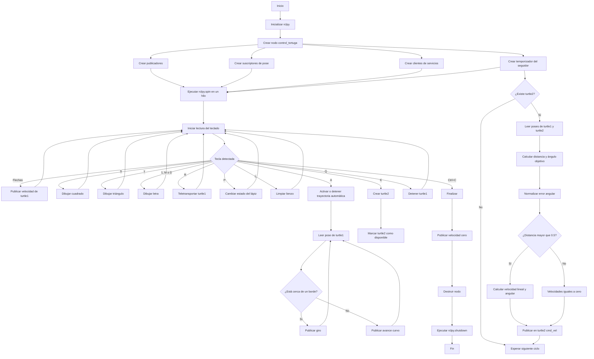

<div align="center">
  <picture>
    <source srcset="https://imgur.com/5bYAzsb.png" media="(prefers-color-scheme: dark)">
    <source srcset="https://imgur.com/Os03JoE.png" media="(prefers-color-scheme: light)">
    
  </picture>

  <h1>Laboratorio No. 04 - Robótica de Desarrollo</h1>
  <h2>Introducción a ROS 2 Jazzy Jalisco - Turtlesim</h2>

  <p>
    <strong>Robótica - 2026-I</strong><br>
    Ingeniería Mecatrónica<br>
    Facultad de Ingeniería<br>
    Universidad Nacional de Colombia
  </p>
</div>

---

## Integrantes

* **Pablo de Jesús Elcila Mora**
* **Marco Alejandro Morales Pantoja**
* **Daniel Felipe Castro Garindo**

---

## Solución planteada

En este laboratorio se desarrolló una aplicación en **ROS 2 Jazzy Jalisco** utilizando el simulador **Turtlesim** y un nodo propio programado en Python mediante la biblioteca `rclpy`.

La solución permite controlar manualmente la tortuga principal mediante las flechas del teclado, dibujar figuras geométricas, ejecutar una trayectoria automática, activar o desactivar el lápiz, limpiar el lienzo, reiniciar la posición de la tortuga y dibujar las letras correspondientes a los nombres de los integrantes.

También se implementó un sistema líder-seguidor. En este sistema, `turtle1` funciona como tortuga líder y puede ser controlada mediante el teclado o mediante las funciones automáticas. La segunda tortuga, denominada `turtle2`, recibe comandos de velocidad calculados a partir de la distancia y orientación relativa con respecto a `turtle1`.

Toda la lógica del laboratorio se encuentra integrada en un único nodo propio llamado:

```text
/control_tortuga
```

Este nodo se comunica con el nodo del simulador:

```text
/turtlesim
```

La comunicación se realiza mediante publicadores, suscriptores y clientes de servicios propios de ROS 2.

---

## Objetivos

### Objetivo general

Implementar una aplicación en ROS 2 Jazzy Jalisco que permita controlar dos tortugas en Turtlesim utilizando publicación, suscripción, servicios, temporizadores y herramientas de inspección de la arquitectura de comunicación.

### Objetivos específicos

* Conocer los conceptos básicos de ROS 2.
* Utilizar comandos fundamentales de ROS 2 en Ubuntu 24.04.
* Crear un nodo propio en Python mediante `rclpy`.
* Publicar comandos de velocidad utilizando mensajes `Twist`.
* Suscribirse a los tópicos de posición de las tortugas.
* Utilizar servicios para crear, teletransportar y modificar tortugas.
* Implementar el control manual de `turtle1`.
* Dibujar figuras geométricas automáticamente.
* Dibujar letras personalizadas.
* Implementar una trayectoria automática con detección de bordes.
* Desarrollar un sistema líder-seguidor.
* Analizar los nodos, tópicos y servicios de la aplicación.
* Visualizar la arquitectura mediante `rqt_graph`.

---

## Requisitos

El laboratorio fue desarrollado utilizando:

* Ubuntu 24.04.
* ROS 2 Jazzy Jalisco.
* Python 3.
* `rclpy`.
* Turtlesim.
* `rqt_graph`.
* `colcon`.

Los paquetes principales pueden instalarse mediante:

```bash
sudo apt update
sudo apt install ros-jazzy-turtlesim
sudo apt install ros-jazzy-rqt-graph
sudo apt install python3-colcon-common-extensions
```

Antes de trabajar con ROS 2 se debe cargar su entorno:

```bash
source /opt/ros/jazzy/setup.bash
```

---

## Estructura del repositorio

```text
Laboratorio No. 04 - Robótica de Desarrollo/
├── img/
│   ├── NodesOnly.png
│   ├── NodesTopicsActive.png
│   └── NodesTopicsAll.png
├── src/
└── README.MD
```

La carpeta `img` contiene las capturas obtenidas mediante `rqt_graph`.

La carpeta `src` contiene el código fuente y los archivos correspondientes al paquete de ROS 2.

Las carpetas generadas automáticamente durante la compilación no deben agregarse al repositorio:

```text
build/
install/
log/
```

---

## Preparación del workspace

Para trabajar con el paquete se debe acceder al workspace:

```bash
cd ~/ros2_jazzy_jalisco/turtlesim_ws
```

Cargar el entorno de ROS 2:

```bash
source /opt/ros/jazzy/setup.bash
```

Compilar el workspace:

```bash
colcon build
```

Cargar el entorno generado por la compilación:

```bash
source install/setup.bash
```

---

## Ejecución

En una primera terminal se ejecuta Turtlesim:

```bash
ros2 run turtlesim turtlesim_node
```

En una segunda terminal se carga el workspace:

```bash
source /opt/ros/jazzy/setup.bash
source ~/ros2_jazzy_jalisco/turtlesim_ws/install/setup.bash
```

Posteriormente se ejecuta el nodo desarrollado:

```bash
ros2 run my_turtle_controller move_turtle
```

Al iniciar el programa se presenta en la terminal la leyenda con los controles disponibles.

---

## Controles implementados

| Tecla            | Acción                                                   |
| ---------------- | -------------------------------------------------------- |
| Flecha arriba    | Avanzar `turtle1`                                        |
| Flecha abajo     | Retroceder `turtle1`                                     |
| Flecha izquierda | Girar hacia la izquierda                                 |
| Flecha derecha   | Girar hacia la derecha                                   |
| `S`              | Dibujar un cuadrado                                      |
| `T`              | Dibujar un triángulo equilátero                          |
| `R`              | Llevar `turtle1` al centro                               |
| `P`              | Activar o desactivar el lápiz                            |
| `A`              | Activar o detener la trayectoria automática              |
| `Q`              | Detener `turtle1` y desactivar la trayectoria automática |
| `1`              | Dibujar la letra P                                       |
| `M`              | Dibujar la letra M                                       |
| `D`              | Dibujar la letra D                                       |
| `K`              | Crear `turtle2`                                          |
| `L`              | Limpiar los trazos del lienzo                            |
| `Ctrl+C`         | Finalizar el programa                                    |

La letra P se asignó a la tecla `1` porque la tecla `P` ya estaba reservada para activar o desactivar el lápiz.

---

## Arquitectura de ROS 2

Durante la ejecución se encuentran activos principalmente dos nodos.

| Nodo               | Función                                                                                                         |
| ------------------ | --------------------------------------------------------------------------------------------------------------- |
| `/turtlesim`       | Administra la ventana gráfica, las tortugas, sus posiciones y los servicios del simulador.                      |
| `/control_tortuga` | Lee el teclado, publica velocidades, recibe posiciones, consume servicios y controla el sistema líder-seguidor. |

### Publicadores

El nodo `/control_tortuga` crea dos publicadores de mensajes `geometry_msgs/msg/Twist`.

| Tópico             | Función                                              |
| ------------------ | ---------------------------------------------------- |
| `/turtle1/cmd_vel` | Enviar velocidades lineales y angulares a `turtle1`. |
| `/turtle2/cmd_vel` | Enviar velocidades calculadas a `turtle2`.           |

### Suscriptores

El nodo recibe la posición de las dos tortugas mediante mensajes `turtlesim/msg/Pose`.

| Tópico          | Función                                         |
| --------------- | ----------------------------------------------- |
| `/turtle1/pose` | Obtener la posición y orientación de `turtle1`. |
| `/turtle2/pose` | Obtener la posición y orientación de `turtle2`. |

### Servicios

| Servicio                     | Tipo                             | Función                                         |
| ---------------------------- | -------------------------------- | ----------------------------------------------- |
| `/spawn`                     | `turtlesim/srv/Spawn`            | Crear `turtle2`.                                |
| `/turtle1/set_pen`           | `turtlesim/srv/SetPen`           | Activar o desactivar el lápiz de `turtle1`.     |
| `/turtle1/teleport_absolute` | `turtlesim/srv/TeleportAbsolute` | Llevar `turtle1` al centro.                     |
| `/clear`                     | `std_srvs/srv/Empty`             | Limpiar los trazos del lienzo.                  |
| `/reset`                     | `std_srvs/srv/Empty`             | Cliente disponible para reiniciar el simulador. |

El cliente `/reset` se encuentra declarado en el código, aunque la tecla `R` utiliza realmente el servicio `/turtle1/teleport_absolute`.

---

## Lectura del teclado

La función `leer_tecla()` permite capturar las entradas del teclado sin necesidad de presionar `Enter`.

Para esto se utilizan las bibliotecas:

* `sys`
* `tty`
* `termios`
* `select`

La configuración actual de la terminal se guarda mediante `termios.tcgetattr()`. Después, la terminal se coloca temporalmente en modo de lectura directa utilizando `tty.setraw()`.

La función `select.select()` comprueba si existe una tecla disponible con un tiempo de espera de `0.05 s`. Esto evita que el programa permanezca bloqueado esperando una entrada.

Las flechas generan una secuencia de caracteres que comienza con el carácter de escape `\x1b`. Por esta razón, cuando se detecta dicho carácter se leen dos caracteres adicionales.

Al finalizar la lectura siempre se restaura la configuración original de la terminal.

---

## Control manual de `turtle1`

El método `vel()` crea un mensaje `Twist` y asigna:

```python
msg.linear.x = lineal
msg.angular.z = angular
```

Posteriormente publica el mensaje en:

```text
/turtle1/cmd_vel
```

Los valores utilizados para el control manual son:

| Movimiento           | Velocidad lineal | Velocidad angular |
| -------------------- | ---------------: | ----------------: |
| Avanzar              |            `2.0` |             `0.0` |
| Retroceder           |           `-2.0` |             `0.0` |
| Girar a la izquierda |            `0.0` |             `1.5` |
| Girar a la derecha   |            `0.0` |            `-1.5` |
| Detener              |            `0.0` |             `0.0` |

El método `parar()` llama al método `vel()` con ambos valores iguales a cero.

---

## Generación de movimientos temporizados

El método `mover()` recibe tres parámetros:

```text
Velocidad lineal
Velocidad angular
Duración
```

La cantidad de pasos se obtiene mediante:

```python
pasos = int(duracion * 20)
```

Cada paso dura `0.05 s`, por lo que se realizan aproximadamente veinte publicaciones por segundo.

Al finalizar la secuencia se llama a `parar()` para detener `turtle1`.

---

## Cuadrado

La tecla `S` ejecuta el método `cuadrado()`.

El procedimiento repite cuatro veces:

1. Avanzar durante `2 s`.
2. Girar durante (\pi/2) segundos con una velocidad angular de `1 rad/s`.

El giro total de cada esquina es aproximadamente:

[
\theta=1\frac{\text{rad}}{\text{s}}\cdot\frac{\pi}{2}\text{s}
=\frac{\pi}{2}\text{ rad}
]

Esto corresponde a un giro de aproximadamente (90^\circ).

---

## Triángulo equilátero

La tecla `T` ejecuta el método `triangulo()`.

El procedimiento repite tres veces:

1. Avanzar durante `2 s`.
2. Girar durante (2\pi/3) segundos con una velocidad angular de `1 rad/s`.

El ángulo de giro es:

[
\theta=\frac{2\pi}{3}\text{ rad}=120^\circ
]

Este es el ángulo exterior necesario para construir un triángulo equilátero.

---

## Letras personalizadas

Se implementaron tres letras relacionadas con los nombres de los integrantes.

| Letra | Integrante | Tecla |
| ----- | ---------- | ----- |
| P     | Pablo      | `1`   |
| M     | Marco      | `M`   |
| D     | Daniel     | `D`   |

Las letras se construyen mediante combinaciones de:

* Movimientos lineales.
* Giros.
* Segmentos rectos.
* Movimientos lineales y angulares simultáneos.
* Aproximaciones de arcos.

Cada letra se ejecuta en un hilo independiente para evitar que la secuencia bloquee la comunicación de ROS 2.

---

## Control del lápiz

La tecla `P` ejecuta el método `toggle_lapiz()`.

Este método cambia el estado de la variable:

```python
self.lapiz_activo
```

Después utiliza el servicio:

```text
/turtle1/set_pen
```

El lápiz se configura con:

```text
R = 255
G = 255
B = 255
Ancho = 2
```

El parámetro `off` determina si el lápiz se encuentra activo o desactivado.

```python
req.off = 0 if self.lapiz_activo else 1
```

---

## Reinicio de posición

La tecla `R` utiliza el servicio:

```text
/turtle1/teleport_absolute
```

La posición definida es:

```text
x = 5.544
y = 5.544
theta = 0.0
```

Estas coordenadas corresponden aproximadamente al centro del lienzo de Turtlesim.

El teletransporte permite cambiar la posición de forma instantánea sin generar una trayectoria desde la posición anterior.

---

## Limpieza del lienzo

La tecla `L` realiza una llamada asíncrona al servicio:

```text
/clear
```

Este servicio elimina los trazos existentes sin cerrar el simulador ni eliminar las tortugas.

Esta función facilita la realización de varias pruebas consecutivas.

---

## Trayectoria automática

La tecla `A` activa o desactiva la trayectoria automática.

La posición actual de `turtle1` se obtiene mediante el tópico:

```text
/turtle1/pose
```

Se considera que la tortuga se encuentra cerca de un borde cuando se cumple alguna de estas condiciones:

```python
x < 1.0
x > 10.0
y < 1.0
y > 10.0
```

Cuando la tortuga se encuentra lejos de los bordes se publica:

```python
self.vel(1.5, 0.2)
```

Esto produce un avance con una ligera curvatura.

Cuando se detecta un borde se publica:

```python
self.vel(0.0, 1.5)
```

La tortuga deja de avanzar y gira hasta recuperar una orientación que le permita continuar dentro de la ventana.

---

## Creación de `turtle2`

La tecla `K` ejecuta el método `crear_tortuga2()`.

La segunda tortuga se crea utilizando el servicio:

```text
/spawn
```

Sus parámetros iniciales son:

```text
x = 2.0
y = 2.0
theta = 0.0
name = turtle2
```

La solicitud se realiza de forma asíncrona mediante `call_async()`.

Cuando el servicio responde correctamente, el callback `spawn_listo()` establece:

```python
self.t2_lista = True
```

A partir de ese momento se habilita el sistema líder-seguidor.

La creación se dejó asociada a una tecla para permitir que las funciones de `turtle1` pudieran probarse antes de activar a la segunda tortuga.

---

## Sistema líder-seguidor

El método `seguir()` se ejecuta mediante un temporizador con un periodo de `0.1 s`.

```python
self.create_timer(0.1, self.seguir)
```

La frecuencia de actualización es:

[
f=\frac{1}{0.1}=10\text{ Hz}
]

Cuando `turtle2` existe, se calculan las diferencias de posición:

[
\Delta x=x_1-x_2
]

[
\Delta y=y_1-y_2
]

La distancia euclidiana es:

[
d=\sqrt{(\Delta x)^2+(\Delta y)^2}
]

El ángulo desde `turtle2` hacia `turtle1` se obtiene mediante:

[
\theta_d=\operatorname{atan2}(\Delta y,\Delta x)
]

El error angular se calcula como:

[
e_\theta=\theta_d-\theta_2
]

El error se normaliza utilizando:

```python
error_angulo = math.atan2(
    math.sin(error_angulo),
    math.cos(error_angulo)
)
```

Esta operación mantiene el error dentro del intervalo:

[
-\pi\le e_\theta\le\pi
]

Cuando la distancia es mayor que `0.5`, se aplican las siguientes leyes de control:

[
v=1.5d
]

[
\omega=6e_\theta
]

La velocidad lineal depende de la distancia y la velocidad angular depende del error de orientación.

Cuando la distancia es menor o igual que `0.5`, el mensaje `Twist` conserva velocidades iguales a cero y `turtle2` se detiene.

---

## Ejecución mediante hilos

La comunicación de ROS 2 se mantiene activa mediante:

```python
rclpy.spin(nodo)
```

Este proceso se ejecuta en un hilo secundario:

```python
hilo = threading.Thread(target=rclpy.spin, args=(nodo,), daemon=True)
```

El hilo principal ejecuta el método:

```python
nodo.correr()
```

Esta separación permite que la lectura del teclado se realice al mismo tiempo que:

* Se reciben las poses.
* Se ejecuta el temporizador del seguidor.
* Se procesan las respuestas de servicios.
* Se publican los comandos de velocidad.

Las figuras, letras y trayectoria automática también se ejecutan mediante hilos independientes.

---

## Diagrama de flujo

El siguiente diagrama fue desarrollado en Mermaid para que pueda visualizarse y editarse directamente desde GitHub.



---

## Código fuente implementado

```python
'''
import rclpy
from rclpy.node import Node
from geometry_msgs.msg import Twist

class TurtleController(Node):
    def __init__(self):
        super().__init__('turtle_controller')
        self.publisher_ = self.create_publisher(Twist, '/turtle1/cmd_vel', 10)
        self.timer = self.create_timer(0.5, self.move_turtle)

    def move_turtle(self):
        msg = Twist()
        msg.linear.x = 2.0   # Velocidad hacia adelante
        msg.angular.z = 1.0  # Rotación
        self.publisher_.publish(msg)
        self.get_logger().info('Moviendo la tortuga')

def main(args=None):
    rclpy.init(args=args)
    node = TurtleController()
    rclpy.spin(node)
    node.destroy_node()
    rclpy.shutdown()
'''

import rclpy
from rclpy.node import Node
from geometry_msgs.msg import Twist
from turtlesim.msg import Pose
from turtlesim.srv import Spawn, SetPen, TeleportAbsolute
from std_srvs.srv import Empty
import sys, tty, termios, select, math, time, threading

def leer_tecla():
    fd = sys.stdin.fileno()
    cfg = termios.tcgetattr(fd)
    try:
        tty.setraw(fd)
        r, _, _ = select.select([sys.stdin], [], [], 0.05)
        if r:
            k = sys.stdin.read(1)
            if k == '\x1b':
                k += sys.stdin.read(2)
            return k
        return None
    finally:
        termios.tcsetattr(fd, termios.TCSADRAIN, cfg)


class ControlTortuga(Node):

    def __init__(self):
        super().__init__('control_tortuga')

        # publicadores
        self.pub1 = self.create_publisher(Twist, '/turtle1/cmd_vel', 10)
        self.pub2 = self.create_publisher(Twist, '/turtle2/cmd_vel', 10)

        # suscriptores de posicion
        self.pose1 = Pose()
        self.pose2 = Pose()
        self.create_subscription(Pose, '/turtle1/pose', self.cb_pose1, 10)
        self.create_subscription(Pose, '/turtle2/pose', self.cb_pose2, 10)

        # clientes de servicios
        self.cli_spawn = self.create_client(Spawn, '/spawn')
        self.cli_pen   = self.create_client(SetPen, '/turtle1/set_pen')
        self.cli_tp    = self.create_client(TeleportAbsolute, '/turtle1/teleport_absolute')
        self.cli_reset = self.create_client(Empty, '/reset')
        self.cli_clear = self.create_client(Empty, '/clear')

        self.lapiz_activo = True
        self.auto_corriendo = False
        self.t2_lista = False

        # timer del seguidor (10 Hz)
        self.create_timer(0.1, self.seguir)

        self.get_logger().info('Flechas=mover | S=cuadrado | T=triangulo | R=reset | P=lapiz | A=auto | Q=stop | K=crear turtle2 | L=limpiar | 1=P | M=M | D=D')

        #self.crear_tortuga2())

    # callbacks pose

    def cb_pose1(self, msg):
        self.pose1 = msg

    def cb_pose2(self, msg):
        self.pose2 = msg

    # publicar velocidad
    def vel(self, lineal, angular):
        msg = Twist()
        msg.linear.x = lineal
        msg.angular.z = angular
        self.pub1.publish(msg)

    def parar(self):
        self.vel(0.0, 0.0)

    # mover durante N segundos
    def mover(self, lineal, angular, duracion):
        pasos = int(duracion * 20)
        for _ in range(pasos):
            self.vel(lineal, angular)
            time.sleep(0.05)
        self.parar()

    # crear turtle2
    def crear_tortuga2(self):
        self.cli_spawn.wait_for_service(timeout_sec=3.0)
        req = Spawn.Request()
        req.x = 2.0
        req.y = 2.0
        req.theta = 0.0
        req.name = 'turtle2'
        future = self.cli_spawn.call_async(req)
        future.add_done_callback(self.spawn_listo)

    def spawn_listo(self, future):
        try:
            future.result()
            self.t2_lista = True
            self.get_logger().info('turtle2 creada')
        except Exception as e:
            self.get_logger().warn(f'No se creo turtle2: {e}')

    # einiciar posicion

    def reset_pos(self):
        self.cli_tp.wait_for_service(timeout_sec=2.0)
        req = TeleportAbsolute.Request()
        req.x = 5.544
        req.y = 5.544
        req.theta = 0.0
        self.cli_tp.call_async(req)

    # lapiz

    def toggle_lapiz(self):
        self.lapiz_activo = not self.lapiz_activo
        self.cli_pen.wait_for_service(timeout_sec=2.0)
        req = SetPen.Request()
        req.r = 255
        req.g = 255
        req.b = 255
        req.width = 2
        req.off = 0 if self.lapiz_activo else 1
        self.cli_pen.call_async(req)

    # cuadrado
    def cuadrado(self):
        def tarea():
            for _ in range(4):
                self.mover(1.0, 0.0, 2.0)
                self.mover(0.0, 1.0, math.pi / 2)
        threading.Thread(target=tarea, daemon=True).start()

    # triangulo 
    def triangulo(self):
        def tarea():
            for _ in range(3):
                self.mover(1.0, 0.0, 2.0)
                self.mover(0.0, 1.0, 2 * math.pi / 3)
        threading.Thread(target=tarea, daemon=True).start()

    # Trayectoria automatica evitando bordes

    def auto(self):
        if self.auto_corriendo:
            self.auto_corriendo = False
            self.parar()
            return
        self.auto_corriendo = True

        def tarea():
            while self.auto_corriendo and rclpy.ok():
                x = self.pose1.x
                y = self.pose1.y
                cerca_borde = x < 1.0 or x > 10.0 or y < 1.0 or y > 10.0
                if cerca_borde:
                    self.vel(0.0, 1.5)
                else:
                    self.vel(1.5, 0.2)
                time.sleep(0.05)
            self.parar()

        threading.Thread(target=tarea, daemon=True).start()

    # Letras P, M, D

    def letra_P(self):
        # P
        def tarea():
            self.mover(0.0, 1.57, 1.0) # gira 90 izquierda
            self.mover(1.0, 0.0, 2.0)   # palo vertical
            self.mover(0.0, -1.57, 1.0) # gira 90 derecha
            self.mover(1.0, 1.0, 3.14)  # semicirculo
            self.mover(0.0, 1.57, 1.0) # endereza
            self.mover(1.0, 0.0, 2.0)   # palo vertical
        threading.Thread(target=tarea, daemon=True).start()

    def letra_M(self):
        # M
        def tarea():
            self.mover(0.0, 1.57, 1.0) # gira 90 izquierda
            self.mover(1.0, 0.0, 1.5)   # sube
            self.mover(0.0, -2.356, 1.0)  # gira 90+45 derecha
            self.mover(1.0, 0.0, 0.5)   # palito
            self.mover(0.0, 1.57, 1.0)  # gira 90 izquierda
            self.mover(1.0, 0.0, 0.5)   # palito
            self.mover(0.0, -2.356, 1.0)  # gira 90 izquierda
            self.mover(1.0, 0.0, 1.5)   # naja

        threading.Thread(target=tarea, daemon=True).start()

    def letra_D(self):
        # D
        def tarea():
            self.mover(1.0, 1.0, 3.14)  # semicirculo
            self.mover(0.0, 1.57, 1.0) # gira 90 izquierda
            self.mover(1.0, 0.0, 2.0)   # palo vertical
        threading.Thread(target=tarea, daemon=True).start()

    # seguidor turtle2 a turtle1
    def seguir(self):
        if not self.t2_lista:
            return

        dx = self.pose1.x - self.pose2.x
        dy = self.pose1.y - self.pose2.y
        dist = math.sqrt(dx**2 + dy**2)
        angulo_objetivo = math.atan2(dy, dx)
        error_angulo = angulo_objetivo - self.pose2.theta
        error_angulo = math.atan2(math.sin(error_angulo), math.cos(error_angulo))

        cmd = Twist()
        if dist > 0.5:
            cmd.linear.x = 1.5 * dist
            cmd.angular.z = 6.0 * error_angulo
        self.pub2.publish(cmd)

    # bucle principal de teclado
    def correr(self):
        try:
            while rclpy.ok():
                k = leer_tecla()
                if k is None:
                    continue

                if   k == '\x1b[A': self.vel(2.0, 0.0)   # arriba
                elif k == '\x1b[B': self.vel(-2.0, 0.0)  # abajo
                elif k == '\x1b[D': self.vel(0.0, 1.5)   # izquierda
                elif k == '\x1b[C': self.vel(0.0, -1.5)  # derecha
                elif k.lower() == 's': self.cuadrado()
                elif k.lower() == 't': self.triangulo()
                elif k.lower() == 'r': self.reset_pos()
                elif k.lower() == 'p': self.toggle_lapiz()
                elif k.lower() == 'a': self.auto()
                elif k.lower() == 'q':
                    self.auto_corriendo = False
                    self.parar()
                elif k.lower() == '1': self.letra_P()
                elif k.lower() == 'm': self.letra_M()
                elif k.lower() == 'd': self.letra_D()
                elif k.lower() == 'k': self.crear_tortuga2()
                elif k.lower() == 'l': self.cli_clear.call_async(Empty.Request())
                elif k == '\x03': break  # Ctrl+C

        finally:
            self.parar()


def main(args=None):
    rclpy.init(args=args)
    nodo = ControlTortuga()

    hilo = threading.Thread(target=rclpy.spin, args=(nodo,), daemon=True)
    hilo.start()

    nodo.correr()

    nodo.destroy_node()
    rclpy.shutdown()


if __name__ == '__main__':
    main()
```

---

## Verificación de la arquitectura

### Lista de nodos

El comando:

```bash
ros2 node list
```

permite visualizar los nodos activos.

Durante la ejecución se observaron:

```text
/control_tortuga
/turtlesim
```

Esto confirma que el nodo propio y el nodo del simulador se encuentran activos dentro del mismo entorno de ROS 2.

### Lista de tópicos

El comando:

```bash
ros2 topic list
```

permite identificar los canales de comunicación activos.

Los tópicos principales utilizados por la aplicación son:

```text
/turtle1/cmd_vel
/turtle1/pose
/turtle2/cmd_vel
/turtle2/pose
```

### Pose de `turtle1`

El comando:

```bash
ros2 topic echo /turtle1/pose
```

permite observar en tiempo real:

* Posición `x`.
* Posición `y`.
* Orientación `theta`.
* Velocidad lineal.
* Velocidad angular.

Durante una rotación sin avance, las posiciones `x` y `y` permanecen prácticamente constantes, mientras la orientación `theta` cambia continuamente.

### Información del tópico de velocidad

El comando:

```bash
ros2 topic info /turtle1/cmd_vel
```

permite identificar:

* Tipo de mensaje.
* Número de publicadores.
* Número de suscriptores.

Durante la ejecución se obtuvo un publicador y un suscriptor activos para este tópico.

### Lista de servicios

El comando:

```bash
ros2 service list
```

permite verificar los servicios disponibles.

Entre los servicios utilizados se encuentran:

```text
/spawn
/clear
/reset
/turtle1/set_pen
/turtle1/teleport_absolute
```

---

## Visualización con `rqt_graph`

La arquitectura se visualizó mediante:

```bash
rqt_graph
```

### Vista Nodes only

<div align="center">
  
</div>

En esta vista se observan claramente los nodos:

```text
/control_tortuga
/turtlesim
```

Los tópicos `/turtle1/cmd_vel` y `/turtle2/cmd_vel` se dirigen desde `/control_tortuga` hacia `/turtlesim`.

Los tópicos `/turtle1/pose` y `/turtle2/pose` se dirigen desde `/turtlesim` hacia `/control_tortuga`.

Esto confirma que el nodo propio envía comandos de movimiento y recibe la posición de las dos tortugas.

### Vista Nodes/Topics active

<div align="center">
  
</div>

Esta vista presenta únicamente los tópicos que poseen publicadores y suscriptores activos.

Se observan los canales:

```text
/turtle1/cmd_vel
/turtle1/pose
/turtle2/cmd_vel
/turtle2/pose
```

La presencia de los cuatro tópicos confirma que la comunicación entre el nodo propio y Turtlesim se encuentra activa.

### Vista Nodes/Topics all

<div align="center">
  
</div>

Esta vista muestra la arquitectura completa de los nodos y tópicos.

En este caso, las vistas `active` y `all` presentan los mismos canales principales. Esto indica que los tópicos declarados cuentan con publicadores y suscriptores conectados y que no existen canales principales sin utilizar.

---

## Decisiones de diseño

### Un único nodo propio

Todas las funciones se integraron dentro de `/control_tortuga`. Esto permite controlar el teclado, los publicadores, los suscriptores, los servicios y el sistema seguidor desde una misma clase.

### Creación manual de `turtle2`

La segunda tortuga se crea mediante la tecla `K`. Esta decisión facilita las pruebas de las figuras y letras de `turtle1` antes de activar el sistema líder-seguidor.

### Lectura no bloqueante

La lectura del teclado utiliza `select` con un tiempo de espera de `0.05 s`. Esto evita detener permanentemente el programa mientras se espera una tecla.

### Uso de hilos

Las figuras, letras y trayectoria automática se ejecutan en hilos independientes. Esto permite mantener activos los callbacks, temporizadores y servicios de ROS 2.

### Teletransporte para el reinicio

La tecla `R` utiliza `/turtle1/teleport_absolute`. Esto permite regresar al centro sin dibujar una línea desde la posición anterior.

### Uso de la tecla `1`

La letra P se asignó a la tecla `1` porque la tecla `P` se utiliza para controlar el lápiz.

### Limpieza mediante `/clear`

La tecla `L` se agregó para borrar los trazos del lienzo y facilitar la realización de nuevas pruebas.

---

## Evidencias de funcionamiento

Durante la ejecución se verificaron las siguientes funciones:

* Movimiento manual mediante las flechas.
* Reinicio de la posición mediante `R`.
* Limpieza del lienzo mediante `L`.
* Dibujo del cuadrado mediante `S`.
* Dibujo del triángulo mediante `T`.
* Dibujo de la letra P mediante `1`.
* Dibujo de la letra M mediante `M`.
* Dibujo de la letra D mediante `D`.
* Activación y desactivación del lápiz mediante `P`.
* Creación de `turtle2` mediante `K`.
* Seguimiento de `turtle2` hacia `turtle1`.
* Trayectoria automática mediante `A`.
* Detección de bordes.
* Detención mediante `Q`.
* Visualización de nodos y tópicos mediante `rqt_graph`.

La ejecución completa y las pruebas de funcionamiento pueden observarse en el video del laboratorio.

---

## Resultados

El nodo desarrollado permitió controlar correctamente a `turtle1` mediante las flechas del teclado sin utilizar `turtle_teleop_key`.

Las figuras geométricas se generaron mediante secuencias de movimientos lineales y angulares. Las letras P, M y D se construyeron mediante combinaciones de segmentos rectos y arcos aproximados.

La trayectoria automática utilizó la pose de `turtle1` para detectar la proximidad a los bordes. Cuando la tortuga alcanzaba una zona cercana al límite, detenía el avance lineal y comenzaba a girar.

La segunda tortuga fue creada mediante el servicio `/spawn`. Después de su creación, el temporizador ejecutó el algoritmo de seguimiento diez veces por segundo.

El control proporcional permitió que `turtle2` ajustara su velocidad lineal según la distancia y su velocidad angular según el error de orientación.

Las herramientas de inspección permitieron comprobar que los nodos, tópicos y servicios se encontraban activos y correctamente conectados.

---

## Análisis

La aplicación demuestra que en ROS 2 los nodos no modifican directamente el estado de otros elementos. La comunicación se realiza mediante mensajes y servicios.

El nodo `/control_tortuga` publica mensajes `Twist`, pero es el nodo `/turtlesim` el encargado de interpretar estos mensajes y modificar el movimiento de las tortugas.

De manera similar, `/turtlesim` publica continuamente las poses. El nodo propio recibe esta información para detectar bordes y calcular el seguimiento.

Los servicios se utilizaron para acciones puntuales que requieren una petición específica, como crear una tortuga, modificar el lápiz o teletransportar a `turtle1`.

El uso de hilos permitió ejecutar secuencias temporizadas sin detener la recepción de poses ni la ejecución del temporizador del seguidor.

La normalización del error angular evita cambios bruscos cuando la orientación pasa de (\pi) a (-\pi). Esta operación permite que `turtle2` seleccione el giro más corto para orientarse hacia `turtle1`.

---

## Video explicativo

El video incluye:

* Presentación de los integrantes.
* Explicación del código.
* Control manual.
* Figuras geométricas.
* Letras personalizadas.
* Activación y desactivación del lápiz.
* Creación de `turtle2`.
* Sistema líder-seguidor.
* Trayectoria automática.
* Comandos de inspección.
* Visualización mediante `rqt_graph`.

<div align="center">
  <a href="https://www.youtube.com/watch?v=oKxvXR15o30">
    
  </a>
</div>

<p align="center">
  <a href="https://www.youtube.com/watch?v=oKxvXR15o30">
    Ver video completo en YouTube
  </a>
</p>

---

## Conclusiones

El desarrollo del laboratorio permitió implementar una aplicación completa en ROS 2 Jazzy Jalisco utilizando Python y `rclpy`.

El control manual permitió comprender el uso de mensajes `Twist` para modificar las velocidades lineales y angulares de una tortuga.

Las figuras geométricas y las letras demostraron que es posible generar trayectorias más complejas mediante secuencias de movimientos básicos.

Los servicios de Turtlesim permitieron crear una segunda tortuga, modificar el estado del lápiz, limpiar el lienzo y cambiar la posición de `turtle1`.

El sistema líder-seguidor permitió aplicar cálculos de distancia, orientación y error angular para controlar automáticamente el movimiento de `turtle2`.

La herramienta `rqt_graph` permitió verificar visualmente la dirección de la comunicación entre `/control_tortuga` y `/turtlesim`.

Finalmente, el laboratorio permitió comprender la relación entre nodos, tópicos, mensajes, servicios, temporizadores y ejecución concurrente dentro de una aplicación de ROS 2.

---

## Referencias

LabSIR UN. *Intro Linux - Ubuntu 24.04*.
https://github.com/labsir-un/01_Rob_2026_I_Intro_Ubuntu_24.04.git

LabSIR UN. *Intro ROS 2 Jazzy Jalisco*.
https://github.com/labsir-un/02_Rob_2026_I_Intro_ROS2_Jazzy.git

LabSIR UN. *Intro Turtlesim con ROS 2 Jazzy Jalisco*.
https://github.com/labsir-un/03_Rob_2026_I_ROS2_Jazzy_Turtlesim.git

LabSIR UN. *Arquitectura de funcionamiento de ROS 2 Jazzy Jalisco*.
https://github.com/labsir-un/04_Rob_2026_I_ROS2_Jazzy_Architecture.git

Open Robotics. *ROS 2 Jazzy Jalisco Installation Guide*.
https://docs.ros.org/en/jazzy/Installation.html

Open Robotics. *Using turtlesim, ros2, and rqt*.
https://docs.ros.org/en/jazzy/Tutorials/Beginner-CLI-Tools/Introducing-Turtlesim/Introducing-Turtlesim.html
