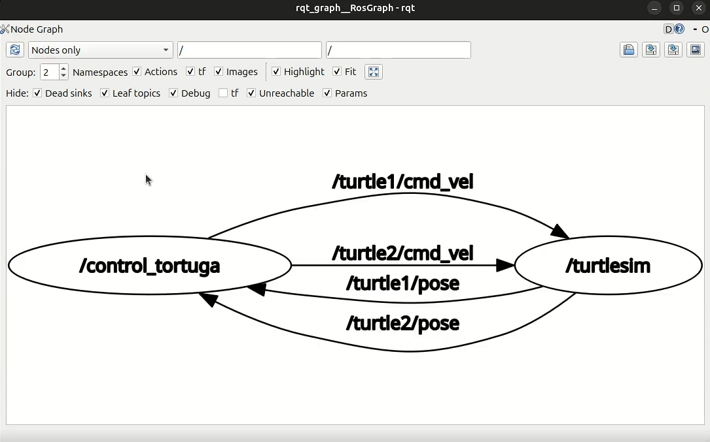
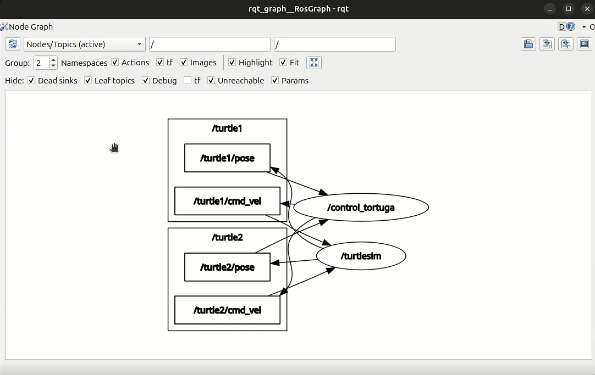
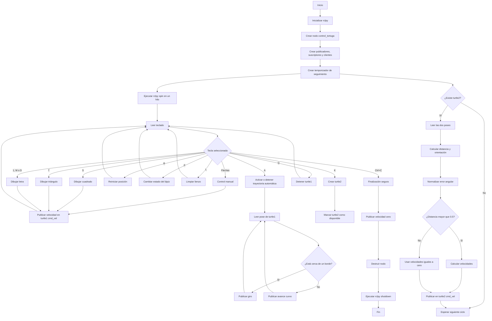

<div align="center">
  <picture>
    <source srcset="https://imgur.com/5bYAzsb.png" media="(prefers-color-scheme: dark)">
    <source srcset="https://imgur.com/Os03JoE.png" media="(prefers-color-scheme: light)">
    
  </picture>

  <h1>Laboratorio No. 04 - Robótica de Desarrollo</h1>
  <h2>Introducción a ROS 2 Jazzy Jalisco - Turtlesim</h2>

  <p>
    <strong>Robótica - 2026-I</strong><br>
    Ingeniería Mecatrónica<br>
    Facultad de Ingeniería<br>
    Universidad Nacional de Colombia
  </p>
</div>

---

## Integrantes

* **Pablo de Jesús Arcila Mora**
* **Marco Alejandro Morales Pantoja**
* **Daniel Felipe Castro Galindo**

---

## a) Documentación del desarrollo

### Descripción general del laboratorio

En este laboratorio se desarrolló una aplicación en **ROS 2 Jazzy Jalisco** usando Python, `rclpy` y el simulador **Turtlesim**.

El trabajo se realizó en el archivo `move_turtle.py` del paquete `my_turtle_controller`. El objetivo fue controlar a `turtle1` directamente desde el teclado, ejecutar trayectorias automáticas, dibujar figuras y letras personalizadas, y crear una segunda tortuga que siguiera a la primera.

Toda la lógica quedó integrada en un nodo propio llamado:

```text
/control_tortuga
```

Este nodo se comunica con el nodo del simulador:

```text
/turtlesim
```

La comunicación se realiza mediante tópicos y servicios de ROS 2. No se utilizó `turtle_teleop_key`, ya que la lectura del teclado y el control de la tortuga fueron programados directamente dentro del script.

---

### Funcionamiento general

Al iniciar el programa se crean:

* Dos publicadores de velocidad.
* Dos suscriptores de posición.
* Cinco clientes de servicios.
* Un temporizador para el sistema líder-seguidor.
* Un bucle para leer el teclado.

`rclpy.spin()` se ejecuta en un hilo secundario. De esta forma, ROS 2 puede seguir procesando mensajes, servicios y temporizadores mientras el hilo principal permanece leyendo las teclas.

Las figuras, las letras y la trayectoria automática también se ejecutan en hilos independientes. Esto evita que las pausas usadas para construir los movimientos bloqueen permanentemente el nodo.

---

### Lectura del teclado

La función `leer_tecla()` permite detectar las teclas sin necesidad de presionar `Enter`.

Primero se guarda la configuración de la terminal:

```python
cfg = termios.tcgetattr(fd)
```

Después se activa el modo de lectura directa:

```python
tty.setraw(fd)
```

La función `select.select()` revisa si hay una tecla disponible. Se usa un tiempo de espera de `0.05 s`, por lo que el programa no se queda esperando indefinidamente.

Las flechas generan una secuencia de tres caracteres. Cuando el primer carácter recibido es `\x1b`, se leen dos caracteres adicionales para determinar cuál flecha fue presionada.

Al terminar la lectura, la configuración original de la terminal se restaura mediante:

```python
termios.tcsetattr(fd, termios.TCSADRAIN, cfg)
```

---

### Control manual de `turtle1`

El control manual se realiza con las flechas del teclado.

| Tecla            | Acción               | Velocidad lineal | Velocidad angular |
| ---------------- | -------------------- | ---------------: | ----------------: |
| Flecha arriba    | Avanzar              |            `2.0` |             `0.0` |
| Flecha abajo     | Retroceder           |           `-2.0` |             `0.0` |
| Flecha izquierda | Girar a la izquierda |            `0.0` |             `1.5` |
| Flecha derecha   | Girar a la derecha   |            `0.0` |            `-1.5` |

El método `vel()` construye un mensaje de tipo `Twist`:

```python
msg = Twist()
msg.linear.x = lineal
msg.angular.z = angular
```

Después publica el mensaje en:

```text
/turtle1/cmd_vel
```

El método `parar()` utiliza la misma función, pero publica ambas velocidades en cero:

```python
self.vel(0.0, 0.0)
```

---

### Funciones automáticas

#### Movimiento temporizado

El método `mover()` recibe una velocidad lineal, una velocidad angular y una duración.

```python
def mover(self, lineal, angular, duracion):
```

La cantidad de pasos se calcula con:

```python
pasos = int(duracion * 20)
```

Cada paso dura `0.05 s`. Por esta razón se realizan aproximadamente veinte publicaciones por segundo.

Cuando termina la secuencia, el método llama a `parar()`.

---

#### Cuadrado

La tecla `S` ejecuta el método `cuadrado()`.

La secuencia repite cuatro veces:

1. Avanzar con velocidad lineal `1.0` durante `2.0 s`.
2. Girar con velocidad angular `1.0 rad/s` durante $\pi/2$ segundos.

El ángulo aproximado de cada giro se obtiene con:

$$
\theta=\omega t
$$

$$
\theta=(1.0\ \text{rad/s})\left(\frac{\pi}{2}\ \text{s}\right)
=\frac{\pi}{2}\ \text{rad}
=90^\circ
$$

Con los cuatro avances y los cuatro giros se forma el cuadrado.

---

#### Triángulo equilátero

La tecla `T` ejecuta el método `triangulo()`.

La secuencia repite tres veces:

1. Avanzar con velocidad lineal `1.0` durante `2.0 s`.
2. Girar con velocidad angular `1.0 rad/s` durante $2\pi/3$ segundos.

El ángulo exterior aplicado en cada vértice es:

$$
\theta=(1.0\ \text{rad/s})
\left(\frac{2\pi}{3}\ \text{s}\right)
=\frac{2\pi}{3}\ \text{rad}
=120^\circ
$$

Este giro permite cerrar el triángulo equilátero después de tres lados.

---

#### Reinicio de la posición

La tecla `R` ejecuta el método `reset_pos()`.

El método consume el servicio:

```text
/turtle1/teleport_absolute
```

La posición definida es:

```text
x = 5.544
y = 5.544
theta = 0.0
```

Estas coordenadas corresponden aproximadamente al centro de la ventana de Turtlesim.

Se utilizó el teletransporte porque permite cambiar la posición de forma instantánea, sin dibujar una línea desde la ubicación anterior.

---

#### Activación y desactivación del lápiz

La tecla `P` ejecuta el método `toggle_lapiz()`.

El método cambia el estado de:

```python
self.lapiz_activo
```

Luego consume el servicio:

```text
/turtle1/set_pen
```

El lápiz se configura con los siguientes valores:

```text
R = 255
G = 255
B = 255
Ancho = 2
```

El parámetro `off` determina si el lápiz se encuentra activo:

```python
req.off = 0 if self.lapiz_activo else 1
```

Cuando `off` es igual a cero, la tortuga dibuja. Cuando es igual a uno, puede moverse sin dejar trazo.

---

#### Trayectoria automática y evasión de bordes

La tecla `A` activa o desactiva el método `auto()`.

La función consulta la posición actual de `turtle1`, recibida desde:

```text
/turtle1/pose
```

Se considera que la tortuga está cerca de un borde cuando se cumple alguna de estas condiciones:

```python
x < 1.0 or x > 10.0 or y < 1.0 or y > 10.0
```

Cuando la tortuga se encuentra lejos de los bordes, se publica:

```python
self.vel(1.5, 0.2)
```

Esto genera un avance con una pequeña curvatura.

Cuando se detecta un borde, se publica:

```python
self.vel(0.0, 1.5)
```

En ese momento se detiene el avance y la tortuga comienza a girar. Cuando deja de cumplir la condición de borde, vuelve a avanzar.

Si la trayectoria ya se encuentra activa y se presiona nuevamente `A`, la variable `auto_corriendo` cambia a `False` y la tortuga se detiene.

---

#### Detención

La tecla `Q` ejecuta:

```python
self.auto_corriendo = False
self.parar()
```

Con esto se desactiva la trayectoria automática y se publican velocidades iguales a cero para `turtle1`.

---

#### Limpieza del lienzo

La tecla `L` llama al servicio:

```text
/clear
```

Este servicio elimina los trazos de la ventana, pero conserva las tortugas y mantiene abierto el simulador.

Se añadió para facilitar las pruebas y evitar que los dibujos anteriores dificultaran la visualización.

---

### Letras personalizadas

Se implementaron tres letras relacionadas con los nombres de los integrantes.

| Tecla | Letra | Integrante |
| ----- | ----- | ---------- |
| `1`   | P     | Pablo      |
| `M`   | M     | Marco      |
| `D`   | D     | Daniel     |

La letra P se asignó a la tecla `1` porque la tecla `P` ya estaba siendo usada para controlar el lápiz.

Cada letra tiene su propio método:

```python
letra_P()
letra_M()
letra_D()
```

Los trazos se forman combinando:

* Movimientos lineales.
* Giros.
* Segmentos rectos.
* Movimientos lineales y angulares al mismo tiempo.
* Arcos aproximados.

Cada letra se ejecuta en un hilo independiente para no detener las demás funciones del nodo.

---

### Sistema líder-seguidor

#### Creación de `turtle2`

La segunda tortuga se crea al presionar la tecla `K`.

El método `crear_tortuga2()` consume el servicio:

```text
/spawn
```

La solicitud se realiza con los siguientes datos:

```text
x = 2.0
y = 2.0
theta = 0.0
name = turtle2
```

La llamada se envía de forma asíncrona:

```python
future = self.cli_spawn.call_async(req)
```

Cuando se recibe la respuesta, se ejecuta el callback `spawn_listo()`.

Si la tortuga fue creada correctamente, se establece:

```python
self.t2_lista = True
```

Esta variable indica que el sistema de seguimiento ya puede comenzar.

`turtle2` no se crea automáticamente porque durante las pruebas era más práctico verificar primero las funciones individuales de `turtle1`.

---

#### Lectura de las posiciones

El nodo se suscribe a:

```text
/turtle1/pose
/turtle2/pose
```

Los callbacks:

```python
cb_pose1()
cb_pose2()
```

guardan los mensajes más recientes en:

```python
self.pose1
self.pose2
```

Estas variables contienen la posición y orientación actual de las dos tortugas.

---

#### Cálculo del seguimiento

El método `seguir()` es ejecutado por un temporizador con un periodo de `0.1 s`:

```python
self.create_timer(0.1, self.seguir)
```

Por lo tanto, la frecuencia de actualización es:

$$
f=\frac{1}{0.1\ \text{s}}=10\ \text{Hz}
$$

Primero se calculan las diferencias entre las posiciones:

$$
\Delta x=x_1-x_2
$$

$$
\Delta y=y_1-y_2
$$

La distancia entre las tortugas se calcula mediante:

$$
d=\sqrt{(\Delta x)^2+(\Delta y)^2}
$$

El ángulo que debe seguir `turtle2` se obtiene con:

$$
\theta_d=\operatorname{atan2}(\Delta y,\Delta x)
$$

El error angular se calcula como:

$$
e_\theta=\theta_d-\theta_2
$$

Después se normaliza mediante:

```python
error_angulo = math.atan2(
    math.sin(error_angulo),
    math.cos(error_angulo)
)
```

Esta operación mantiene el error dentro del intervalo:

$$
-\pi\leq e_\theta\leq\pi
$$

Cuando la distancia es mayor que `0.5`, se aplican las siguientes relaciones:

$$
v=1.5d
$$

$$
\omega=6e_\theta
$$

La velocidad lineal aumenta de acuerdo con la distancia. La velocidad angular depende del error de orientación.

Los comandos se publican en:

```text
/turtle2/cmd_vel
```

Cuando la distancia es menor o igual que `0.5`, el mensaje `Twist` conserva sus valores iniciales en cero. De esta forma, `turtle2` deja de aproximarse cuando ya se encuentra cerca de `turtle1`.

---

### Nodos utilizados

Durante la ejecución se identificaron dos nodos principales:

| Nodo               | Función                                                                                             |
| ------------------ | --------------------------------------------------------------------------------------------------- |
| `/turtlesim`       | Administra la ventana, las tortugas, las poses y los servicios del simulador.                       |
| `/control_tortuga` | Lee el teclado, publica velocidades, recibe posiciones, consume servicios y calcula el seguimiento. |

`/control_tortuga` es el nodo propio desarrollado para el laboratorio.

---

### Tópicos utilizados

| Tópico             | Tipo de mensaje           | Publicador         | Suscriptor         | Función                               |
| ------------------ | ------------------------- | ------------------ | ------------------ | ------------------------------------- |
| `/turtle1/cmd_vel` | `geometry_msgs/msg/Twist` | `/control_tortuga` | `/turtlesim`       | Controlar el movimiento de `turtle1`. |
| `/turtle2/cmd_vel` | `geometry_msgs/msg/Twist` | `/control_tortuga` | `/turtlesim`       | Controlar el movimiento de `turtle2`. |
| `/turtle1/pose`    | `turtlesim/msg/Pose`      | `/turtlesim`       | `/control_tortuga` | Leer la posición de `turtle1`.        |
| `/turtle2/pose`    | `turtlesim/msg/Pose`      | `/turtlesim`       | `/control_tortuga` | Leer la posición de `turtle2`.        |

---

### Servicios utilizados

| Servicio                     | Tipo                             | Función                                     |
| ---------------------------- | -------------------------------- | ------------------------------------------- |
| `/spawn`                     | `turtlesim/srv/Spawn`            | Crear `turtle2`.                            |
| `/turtle1/set_pen`           | `turtlesim/srv/SetPen`           | Activar o desactivar el lápiz.              |
| `/turtle1/teleport_absolute` | `turtlesim/srv/TeleportAbsolute` | Llevar `turtle1` al centro.                 |
| `/clear`                     | `std_srvs/srv/Empty`             | Borrar los trazos del lienzo.               |
| `/reset`                     | `std_srvs/srv/Empty`             | Cliente declarado para el reinicio general. |

El cliente `/reset` está declarado en el código, pero no se utiliza dentro del bucle del teclado. La tecla `R` trabaja con `/turtle1/teleport_absolute`.

---

### Decisiones de diseño

#### Un único nodo propio

Toda la solución se integró dentro de la clase `ControlTortuga`. Así se mantuvieron en el mismo nodo la lectura del teclado, el control de las tortugas y el consumo de servicios.

#### Uso de hilos

Las figuras, las letras y la trayectoria automática incluyen pausas mediante `time.sleep()`.

Estas tareas se ejecutan en hilos secundarios para que la recepción de poses, el temporizador del seguidor y la lectura del teclado puedan seguir funcionando.

#### Separación de `rclpy.spin()` y el teclado

`rclpy.spin()` se ejecuta en un hilo secundario:

```python
hilo = threading.Thread(
    target=rclpy.spin,
    args=(nodo,),
    daemon=True
)
```

El hilo principal ejecuta:

```python
nodo.correr()
```

Con esta separación, ROS 2 procesa su comunicación mientras el programa detecta las teclas.

#### Creación manual de `turtle2`

La segunda tortuga se crea con `K`. Esto permitió probar el control manual, las figuras y las letras antes de activar el seguimiento.

#### Teletransporte para reiniciar

La tecla `R` utiliza `TeleportAbsolute`. Así se evita que la tortuga dibuje una línea al regresar al centro.

---

### Verificación de la arquitectura ROS 2

#### `ros2 node list`

El comando:

```bash
ros2 node list
```

permite consultar los nodos que están activos.

Durante la prueba se observaron:

```text
/control_tortuga
/turtlesim
```

La Figura 1 muestra estos dos nodos y resume la dirección de los cuatro tópicos principales.

<div align="center">
  
</div>

<p align="center"><em>Figura 1. Comunicación entre los nodos /control_tortuga y /turtlesim.</em></p>

Los comandos de velocidad salen de `/control_tortuga` hacia `/turtlesim`. Las poses se transmiten en el sentido contrario.

---

#### `ros2 topic list`

El comando:

```bash
ros2 topic list
```

muestra los tópicos disponibles dentro del sistema.

Los principales tópicos utilizados fueron:

```text
/turtle1/cmd_vel
/turtle1/pose
/turtle2/cmd_vel
/turtle2/pose
```

La Figura 2 muestra estos canales y permite comprobar que cuentan con publicadores y suscriptores activos.

<div align="center">
  
</div>

<p align="center"><em>Figura 2. Nodos y tópicos activos durante la ejecución.</em></p>

---

#### `ros2 topic echo /turtle1/pose`

El comando:

```bash
ros2 topic echo /turtle1/pose
```

permite observar en tiempo real:

* Posición `x`.
* Posición `y`.
* Orientación `theta`.
* Velocidad lineal.
* Velocidad angular.

Durante una rotación sin avance, las coordenadas `x` y `y` permanecen prácticamente constantes. La orientación `theta` cambia y la velocidad angular conserva el valor publicado.

---

#### `ros2 topic info /turtle1/cmd_vel`

El comando:

```bash
ros2 topic info /turtle1/cmd_vel
```

muestra el tipo de mensaje y la cantidad de publicadores y suscriptores.

Durante la ejecución se observó un publicador y un suscriptor. El publicador corresponde a `/control_tortuga` y el suscriptor a `/turtlesim`.

---

#### `ros2 service list`

El comando:

```bash
ros2 service list
```

muestra los servicios disponibles.

Entre los servicios relacionados con el desarrollo se encuentran:

```text
/spawn
/clear
/reset
/turtle1/set_pen
/turtle1/teleport_absolute
```

Estos servicios permiten crear la segunda tortuga, limpiar el lienzo, modificar el lápiz y reposicionar a `turtle1`.

---

#### `rqt_graph`

La herramienta se ejecuta mediante:

```bash
rqt_graph
```

La Figura 3 presenta la vista completa de nodos y tópicos.

<div align="center">
  
</div>

<p align="center"><em>Figura 3. Vista completa de la arquitectura en rqt_graph.</em></p>

En esta prueba, las vistas `Nodes/Topics (active)` y `Nodes/Topics (all)` muestran los mismos canales principales. Esto indica que los cuatro tópicos utilizados cuentan con los extremos de comunicación conectados.

---

## b) Diagrama de flujo

El siguiente diagrama representa la lógica general del programa. Incluye la lectura del teclado, las acciones manuales y automáticas, el seguimiento de `turtle2` y el cierre seguro.



---

## c) Código fuente

El código utilizado en el laboratorio corresponde al archivo `move_turtle.py`.

```python
'''
import rclpy
from rclpy.node import Node
from geometry_msgs.msg import Twist

class TurtleController(Node):
    def __init__(self):
        super().__init__('turtle_controller')
        self.publisher_ = self.create_publisher(Twist, '/turtle1/cmd_vel', 10)
        self.timer = self.create_timer(0.5, self.move_turtle)

    def move_turtle(self):
        msg = Twist()
        msg.linear.x = 2.0   # Velocidad hacia adelante
        msg.angular.z = 1.0  # Rotación
        self.publisher_.publish(msg)
        self.get_logger().info('Moviendo la tortuga')

def main(args=None):
    rclpy.init(args=args)
    node = TurtleController()
    rclpy.spin(node)
    node.destroy_node()
    rclpy.shutdown()
'''

import rclpy
from rclpy.node import Node
from geometry_msgs.msg import Twist
from turtlesim.msg import Pose
from turtlesim.srv import Spawn, SetPen, TeleportAbsolute
from std_srvs.srv import Empty
import sys, tty, termios, select, math, time, threading

def leer_tecla():
    fd = sys.stdin.fileno()
    cfg = termios.tcgetattr(fd)
    try:
        tty.setraw(fd)
        r, _, _ = select.select([sys.stdin], [], [], 0.05)
        if r:
            k = sys.stdin.read(1)
            if k == '\x1b':
                k += sys.stdin.read(2)
            return k
        return None
    finally:
        termios.tcsetattr(fd, termios.TCSADRAIN, cfg)


class ControlTortuga(Node):

    def __init__(self):
        super().__init__('control_tortuga')

        # publicadores
        self.pub1 = self.create_publisher(Twist, '/turtle1/cmd_vel', 10)
        self.pub2 = self.create_publisher(Twist, '/turtle2/cmd_vel', 10)

        # suscriptores de posicion
        self.pose1 = Pose()
        self.pose2 = Pose()
        self.create_subscription(Pose, '/turtle1/pose', self.cb_pose1, 10)
        self.create_subscription(Pose, '/turtle2/pose', self.cb_pose2, 10)

        # clientes de servicios
        self.cli_spawn = self.create_client(Spawn, '/spawn')
        self.cli_pen   = self.create_client(SetPen, '/turtle1/set_pen')
        self.cli_tp    = self.create_client(TeleportAbsolute, '/turtle1/teleport_absolute')
        self.cli_reset = self.create_client(Empty, '/reset')
        self.cli_clear = self.create_client(Empty, '/clear')

        self.lapiz_activo = True
        self.auto_corriendo = False
        self.t2_lista = False

        # timer del seguidor (10 Hz)
        self.create_timer(0.1, self.seguir)

        self.get_logger().info('Flechas=mover | S=cuadrado | T=triangulo | R=reset | P=lapiz | A=auto | Q=stop | K=crear turtle2 | L=limpiar | 1=P | M=M | D=D')

        #self.crear_tortuga2()

    # callbacks pose

    def cb_pose1(self, msg):
        self.pose1 = msg

    def cb_pose2(self, msg):
        self.pose2 = msg

    # publicar velocidad
    def vel(self, lineal, angular):
        msg = Twist()
        msg.linear.x = lineal
        msg.angular.z = angular
        self.pub1.publish(msg)

    def parar(self):
        self.vel(0.0, 0.0)

    # mover durante N segundos
    def mover(self, lineal, angular, duracion):
        pasos = int(duracion * 20)
        for _ in range(pasos):
            self.vel(lineal, angular)
            time.sleep(0.05)
        self.parar()

    # crear turtle2
    def crear_tortuga2(self):
        self.cli_spawn.wait_for_service(timeout_sec=3.0)
        req = Spawn.Request()
        req.x = 2.0
        req.y = 2.0
        req.theta = 0.0
        req.name = 'turtle2'
        future = self.cli_spawn.call_async(req)
        future.add_done_callback(self.spawn_listo)

    def spawn_listo(self, future):
        try:
            future.result()
            self.t2_lista = True
            self.get_logger().info('turtle2 creada')
        except Exception as e:
            self.get_logger().warn(f'No se creo turtle2: {e}')

    # einiciar posicion

    def reset_pos(self):
        self.cli_tp.wait_for_service(timeout_sec=2.0)
        req = TeleportAbsolute.Request()
        req.x = 5.544
        req.y = 5.544
        req.theta = 0.0
        self.cli_tp.call_async(req)

    # lapiz

    def toggle_lapiz(self):
        self.lapiz_activo = not self.lapiz_activo
        self.cli_pen.wait_for_service(timeout_sec=2.0)
        req = SetPen.Request()
        req.r = 255
        req.g = 255
        req.b = 255
        req.width = 2
        req.off = 0 if self.lapiz_activo else 1
        self.cli_pen.call_async(req)

    # cuadrado
    def cuadrado(self):
        def tarea():
            for _ in range(4):
                self.mover(1.0, 0.0, 2.0)
                self.mover(0.0, 1.0, math.pi / 2)
        threading.Thread(target=tarea, daemon=True).start()

    # triangulo 
    def triangulo(self):
        def tarea():
            for _ in range(3):
                self.mover(1.0, 0.0, 2.0)
                self.mover(0.0, 1.0, 2 * math.pi / 3)
        threading.Thread(target=tarea, daemon=True).start()

    # Trayectoria automatica evitando bordes

    def auto(self):
        if self.auto_corriendo:
            self.auto_corriendo = False
            self.parar()
            return
        self.auto_corriendo = True

        def tarea():
            while self.auto_corriendo and rclpy.ok():
                x = self.pose1.x
                y = self.pose1.y
                cerca_borde = x < 1.0 or x > 10.0 or y < 1.0 or y > 10.0
                if cerca_borde:
                    self.vel(0.0, 1.5)
                else:
                    self.vel(1.5, 0.2)
                time.sleep(0.05)
            self.parar()

        threading.Thread(target=tarea, daemon=True).start()

    # Letras P, M, D

    def letra_P(self):
        # P
        def tarea():
            self.mover(0.0, 1.57, 1.0) # gira 90 izquierda
            self.mover(1.0, 0.0, 2.0)   # palo vertical
            self.mover(0.0, -1.57, 1.0) # gira 90 derecha
            self.mover(1.0, 1.0, 3.14)  # semicirculo
            self.mover(0.0, 1.57, 1.0) # endereza
            self.mover(1.0, 0.0, 2.0)   # palo vertical
        threading.Thread(target=tarea, daemon=True).start()

    def letra_M(self):
        # M
        def tarea():
            self.mover(0.0, 1.57, 1.0) # gira 90 izquierda
            self.mover(1.0, 0.0, 1.5)   # sube
            self.mover(0.0, -2.356, 1.0)  # gira 90+45 derecha
            self.mover(1.0, 0.0, 0.5)   # palito
            self.mover(0.0, 1.57, 1.0)  # gira 90 izquierda
            self.mover(1.0, 0.0, 0.5)   # palito
            self.mover(0.0, -2.356, 1.0)  # gira 90 izquierda
            self.mover(1.0, 0.0, 1.5)   # naja

        threading.Thread(target=tarea, daemon=True).start()

    def letra_D(self):
        # D
        def tarea():
            self.mover(1.0, 1.0, 3.14)  # semicirculo
            self.mover(0.0, 1.57, 1.0) # gira 90 izquierda
            self.mover(1.0, 0.0, 2.0)   # palo vertical
        threading.Thread(target=tarea, daemon=True).start()

    # seguidor turtle2 a turtle1
    def seguir(self):
        if not self.t2_lista:
            return

        dx = self.pose1.x - self.pose2.x
        dy = self.pose1.y - self.pose2.y
        dist = math.sqrt(dx**2 + dy**2)
        angulo_objetivo = math.atan2(dy, dx)
        error_angulo = angulo_objetivo - self.pose2.theta
        error_angulo = math.atan2(math.sin(error_angulo), math.cos(error_angulo))

        cmd = Twist()
        if dist > 0.5:
            cmd.linear.x = 1.5 * dist
            cmd.angular.z = 6.0 * error_angulo
        self.pub2.publish(cmd)

    # bucle principal de teclado
    def correr(self):
        try:
            while rclpy.ok():
                k = leer_tecla()
                if k is None:
                    continue

                if   k == '\x1b[A': self.vel(2.0, 0.0)   # arriba
                elif k == '\x1b[B': self.vel(-2.0, 0.0)  # abajo
                elif k == '\x1b[D': self.vel(0.0, 1.5)   # izquierda
                elif k == '\x1b[C': self.vel(0.0, -1.5)  # derecha
                elif k.lower() == 's': self.cuadrado()
                elif k.lower() == 't': self.triangulo()
                elif k.lower() == 'r': self.reset_pos()
                elif k.lower() == 'p': self.toggle_lapiz()
                elif k.lower() == 'a': self.auto()
                elif k.lower() == 'q':
                    self.auto_corriendo = False
                    self.parar()
                elif k.lower() == '1': self.letra_P()
                elif k.lower() == 'm': self.letra_M()
                elif k.lower() == 'd': self.letra_D()
                elif k.lower() == 'k': self.crear_tortuga2()
                elif k.lower() == 'l': self.cli_clear.call_async(Empty.Request())
                elif k == '\x03': break  # Ctrl+C

        finally:
            self.parar()


def main(args=None):
    rclpy.init(args=args)
    nodo = ControlTortuga()

    hilo = threading.Thread(target=rclpy.spin, args=(nodo,), daemon=True)
    hilo.start()

    nodo.correr()

    nodo.destroy_node()
    rclpy.shutdown()


if __name__ == '__main__':
    main()
```

---

## d) Evidencia de funcionamiento

Durante la ejecución se comprobó el movimiento manual de `turtle1`, el dibujo del cuadrado y del triángulo, las letras P, M y D, el control del lápiz, la trayectoria automática y el sistema líder-seguidor.

También se verificaron los nodos, tópicos y servicios desde la consola. La arquitectura puede observarse en las Figuras 1, 2 y 3, donde se aprecia la comunicación entre `/control_tortuga` y `/turtlesim`.

Las pruebas completas de funcionamiento quedaron registradas en el video. Allí se observa la creación de `turtle2`, su aproximación hacia `turtle1` y el comportamiento de las dos tortugas durante las trayectorias.

---

## e) Video explicativo

En el video se presenta el trabajo de los integrantes y se explica el desarrollo del código. También se muestran las funciones principales del programa, el sistema líder-seguidor y la revisión de la arquitectura de ROS 2 mediante comandos de consola y `rqt_graph`. Al final se comentan los resultados obtenidos y los principales aprendizajes del laboratorio.

<div align="center">
  <a href="https://www.youtube.com/watch?v=oKxvXR15o30">
    
  </a>
</div>

<p align="center">
  <a href="https://www.youtube.com/watch?v=oKxvXR15o30">
    Ver video completo en YouTube
  </a>
</p>
