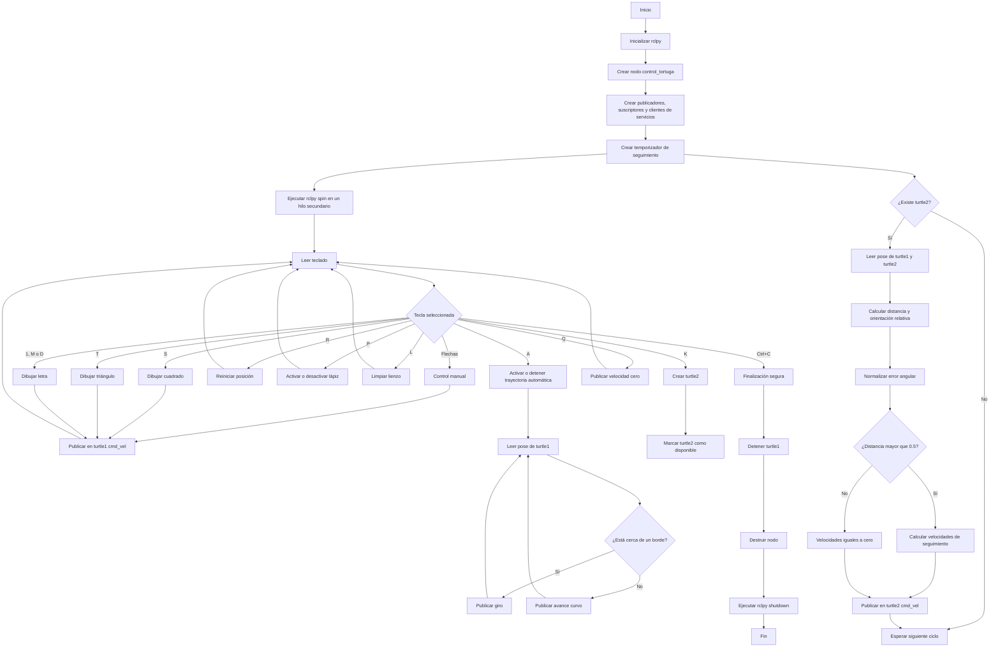

<div align="center">
  <picture>
    <source srcset="https://imgur.com/5bYAzsb.png" media="(prefers-color-scheme: dark)">
    <source srcset="https://imgur.com/Os03JoE.png" media="(prefers-color-scheme: light)">
    
  </picture>

  <h1>Laboratorio No. 04 - Robótica de Desarrollo</h1>
  <h2>Introducción a ROS 2 Jazzy Jalisco - Turtlesim</h2>

  <p>
    <strong>Robótica - 2026-I</strong><br>
    Ingeniería Mecatrónica<br>
    Facultad de Ingeniería<br>
    Universidad Nacional de Colombia
  </p>
</div>

---

## Integrantes

* **Pablo de Jesús Arcila Mora**
* **Marco Alejandro Morales Pantoja**
* **Daniel Felipe Castro Galindo**

---

# a) Documentación del desarrollo

## Descripción general del laboratorio

En este laboratorio se desarrolló una aplicación en **ROS 2 Jazzy Jalisco** utilizando Python, `rclpy` y el simulador **Turtlesim**.

El desarrollo se realizó dentro del archivo `move_turtle.py` del paquete `my_turtle_controller`. El programa permite controlar a `turtle1` mediante el teclado, ejecutar trayectorias automáticas, dibujar figuras geométricas y letras personalizadas, modificar el estado del lápiz y crear una segunda tortuga que sigue automáticamente a la primera.

Toda la lógica se implementó dentro de un nodo propio llamado:

```text
/control_tortuga
```

Este nodo se comunica con:

```text
/turtlesim
```

mediante publicadores, suscriptores y clientes de servicios.

No se utilizó el nodo `turtle_teleop_key`. La lectura del teclado, la publicación de velocidades y las acciones automáticas fueron implementadas directamente en `move_turtle.py`.

---

## Funcionamiento general del programa

Al iniciar el programa se crea el nodo `/control_tortuga`, junto con:

* Dos publicadores de velocidad.
* Dos suscriptores de posición.
* Cinco clientes de servicios.
* Un temporizador para el sistema líder-seguidor.
* Un bucle de lectura del teclado.

La comunicación de ROS 2 se mantiene activa mediante `rclpy.spin()`, ejecutado en un hilo secundario. El hilo principal permanece encargado de leer las teclas y seleccionar las acciones solicitadas por el usuario.

Las figuras, letras y trayectoria automática también se ejecutan en hilos secundarios para evitar que las pausas utilizadas durante los movimientos bloqueen permanentemente el nodo.

---

## Lectura del teclado

La función `leer_tecla()` permite capturar las teclas sin necesidad de presionar `Enter`.

Para esto se utilizan:

* `sys`
* `tty`
* `termios`
* `select`

La configuración de la terminal se guarda mediante:

```python
cfg = termios.tcgetattr(fd)
```

Después se utiliza:

```python
tty.setraw(fd)
```

para realizar la lectura directa de cada tecla.

La función `select.select()` utiliza un tiempo de espera de `0.05 s`, permitiendo comprobar si existe una entrada disponible sin detener indefinidamente la ejecución.

Las flechas del teclado generan secuencias de tres caracteres. Cuando el primer carácter corresponde a `\x1b`, se leen los dos caracteres adicionales necesarios para identificar la dirección.

Al finalizar la lectura se restaura la configuración original de la terminal mediante:

```python
termios.tcsetattr(fd, termios.TCSADRAIN, cfg)
```

---

## Control manual de la tortuga

El control manual de `turtle1` se realiza mediante las flechas del teclado.

| Tecla            | Acción               | Velocidad lineal | Velocidad angular |
| ---------------- | -------------------- | ---------------: | ----------------: |
| Flecha arriba    | Avanzar              |            `2.0` |             `0.0` |
| Flecha abajo     | Retroceder           |           `-2.0` |             `0.0` |
| Flecha izquierda | Girar a la izquierda |            `0.0` |             `1.5` |
| Flecha derecha   | Girar a la derecha   |            `0.0` |            `-1.5` |

El método `vel()` construye un mensaje `Twist`:

```python
msg = Twist()
msg.linear.x = lineal
msg.angular.z = angular
```

El mensaje se publica en:

```text
/turtle1/cmd_vel
```

El método `parar()` publica una velocidad lineal y angular iguales a cero:

```python
self.vel(0.0, 0.0)
```

---

## Funciones automáticas implementadas

### Función de movimiento temporizado

El método `mover()` recibe:

* Velocidad lineal.
* Velocidad angular.
* Duración del movimiento.

La cantidad de pasos se calcula mediante:

```python
pasos = int(duracion * 20)
```

Cada paso tiene una duración de `0.05 s`, por lo que se realizan aproximadamente veinte publicaciones por segundo.

Al terminar el movimiento se llama a `parar()`.

---

### Dibujo del cuadrado

La tecla `S` ejecuta el método `cuadrado()`.

La secuencia se repite cuatro veces:

1. Avanzar con velocidad lineal `1.0` durante `2.0 s`.
2. Girar con velocidad angular `1.0 rad/s` durante (\pi/2) segundos.

El ángulo aproximado de cada giro es:

[
\theta=\omega t
]

[
\theta=(1.0)\left(\frac{\pi}{2}\right)
=\frac{\pi}{2}\text{ rad}
=90^\circ
]

---

### Dibujo del triángulo equilátero

La tecla `T` ejecuta el método `triangulo()`.

La secuencia se repite tres veces:

1. Avanzar con velocidad lineal `1.0` durante `2.0 s`.
2. Girar con velocidad angular `1.0 rad/s` durante (2\pi/3) segundos.

El giro exterior aplicado es:

[
\theta=\frac{2\pi}{3}\text{ rad}
=120^\circ
]

---

### Reinicio de la posición

La tecla `R` ejecuta el método `reset_pos()`.

Este método utiliza el servicio:

```text
/turtle1/teleport_absolute
```

La posición definida es:

```text
x = 5.544
y = 5.544
theta = 0.0
```

Estas coordenadas ubican a `turtle1` aproximadamente en el centro de la ventana.

El teletransporte permite cambiar la posición sin generar un trazo desde la ubicación anterior.

---

### Activación y desactivación del lápiz

La tecla `P` ejecuta el método `toggle_lapiz()`.

El método utiliza el servicio:

```text
/turtle1/set_pen
```

La variable:

```python
self.lapiz_activo
```

almacena el estado actual del lápiz.

La configuración utilizada es:

```text
R = 255
G = 255
B = 255
Ancho = 2
```

El parámetro `off` se define mediante:

```python
req.off = 0 if self.lapiz_activo else 1
```

Cuando `off` es igual a cero, el lápiz se encuentra activo. Cuando es igual a uno, `turtle1` puede desplazarse sin dejar trazo.

---

### Trayectoria automática con evasión de bordes

La tecla `A` activa o desactiva el método `auto()`.

La trayectoria consulta continuamente la posición de `turtle1` mediante los datos recibidos desde:

```text
/turtle1/pose
```

Se considera que la tortuga está cerca de un borde cuando:

```python
x < 1.0 or x > 10.0 or y < 1.0 or y > 10.0
```

Cuando la tortuga no está cerca de un borde, se publica:

```python
self.vel(1.5, 0.2)
```

Esto produce un movimiento hacia adelante con una pequeña velocidad angular.

Cuando se detecta un borde, se publica:

```python
self.vel(0.0, 1.5)
```

La tortuga deja de avanzar y comienza a girar hasta recuperar una orientación que le permita permanecer dentro de la ventana.

Si la trayectoria automática ya se encuentra activa y se vuelve a presionar `A`, la variable `auto_corriendo` cambia a `False` y `turtle1` se detiene.

---

### Detención del movimiento

La tecla `Q` realiza las siguientes acciones:

```python
self.auto_corriendo = False
self.parar()
```

Esto desactiva la trayectoria automática y publica velocidades iguales a cero para `turtle1`.

---

### Limpieza del lienzo

La tecla `L` realiza una llamada al servicio:

```text
/clear
```

Este servicio elimina los trazos presentes en la ventana sin cerrar el simulador ni eliminar las tortugas.

Esta función permite realizar nuevas pruebas sobre un lienzo limpio.

---

## Dibujo de letras personalizadas

Se implementaron las letras P, M y D, asociadas a los nombres de los integrantes.

| Tecla | Letra | Integrante |
| ----- | ----- | ---------- |
| `1`   | P     | Pablo      |
| `M`   | M     | Marco      |
| `D`   | D     | Daniel     |

La letra P se asignó a la tecla `1` porque la tecla `P` ya se utiliza para activar o desactivar el lápiz.

Cada letra posee un método independiente:

```python
letra_P()
letra_M()
letra_D()
```

Las letras se construyen mediante combinaciones de:

* Avances lineales.
* Giros.
* Segmentos rectos.
* Movimientos lineales y angulares simultáneos.
* Aproximaciones de arcos.

Cada función crea una tarea interna y la ejecuta mediante un hilo independiente.

---

## Sistema líder-seguidor con dos tortugas

### Creación de `turtle2`

La segunda tortuga se crea al presionar la tecla `K`.

El método `crear_tortuga2()` utiliza el servicio:

```text
/spawn
```

La solicitud contiene:

```text
x = 2.0
y = 2.0
theta = 0.0
name = turtle2
```

La llamada se realiza de forma asíncrona:

```python
future = self.cli_spawn.call_async(req)
```

Cuando el servicio finaliza, se ejecuta el callback:

```python
spawn_listo()
```

Si la creación fue correcta, se establece:

```python
self.t2_lista = True
```

Esta variable habilita el sistema de seguimiento.

La creación de `turtle2` se dejó asociada a una tecla para permitir que las funciones de `turtle1` pudieran probarse antes de iniciar el seguimiento.

---

### Lectura de las posiciones

El nodo se suscribe a:

```text
/turtle1/pose
/turtle2/pose
```

Los callbacks:

```python
cb_pose1()
cb_pose2()
```

guardan las posiciones más recientes en:

```python
self.pose1
self.pose2
```

Estos datos se utilizan para calcular la distancia y orientación relativa entre las tortugas.

---

### Cálculo del seguimiento

El método `seguir()` se ejecuta mediante un temporizador con periodo de `0.1 s`:

```python
self.create_timer(0.1, self.seguir)
```

La frecuencia de actualización es:

[
f=\frac{1}{0.1}=10\text{ Hz}
]

Las diferencias de posición se calculan mediante:

[
\Delta x=x_1-x_2
]

[
\Delta y=y_1-y_2
]

La distancia entre las tortugas es:

[
d=\sqrt{(\Delta x)^2+(\Delta y)^2}
]

El ángulo objetivo desde `turtle2` hacia `turtle1` se obtiene mediante:

[
\theta_d=\operatorname{atan2}(\Delta y,\Delta x)
]

El error angular es:

[
e_\theta=\theta_d-\theta_2
]

El error se normaliza mediante:

```python
error_angulo = math.atan2(
    math.sin(error_angulo),
    math.cos(error_angulo)
)
```

Esta operación mantiene el error dentro del intervalo:

[
-\pi\leq e_\theta\leq\pi
]

Cuando la distancia es mayor que `0.5`, se aplican las siguientes relaciones:

[
v=1.5d
]

[
\omega=6e_\theta
]

La velocidad lineal aumenta con la distancia entre las tortugas y la velocidad angular depende del error de orientación.

Los comandos calculados se publican en:

```text
/turtle2/cmd_vel
```

Cuando la distancia es menor o igual que `0.5`, el mensaje `Twist` conserva sus valores en cero y `turtle2` deja de aproximarse.

---

## Nodos utilizados

Durante la ejecución se encuentran activos principalmente dos nodos.

| Nodo               | Descripción                                                                                         |
| ------------------ | --------------------------------------------------------------------------------------------------- |
| `/turtlesim`       | Administra la ventana gráfica, las tortugas, sus posiciones y los servicios del simulador.          |
| `/control_tortuga` | Lee el teclado, publica velocidades, recibe posiciones, consume servicios y calcula el seguimiento. |

El nodo `/control_tortuga` es el único nodo propio desarrollado para el laboratorio.

---

## Tópicos utilizados

| Tópico             | Tipo de mensaje           | Publicador         | Suscriptor         | Función                                         |
| ------------------ | ------------------------- | ------------------ | ------------------ | ----------------------------------------------- |
| `/turtle1/cmd_vel` | `geometry_msgs/msg/Twist` | `/control_tortuga` | `/turtlesim`       | Controlar el movimiento de `turtle1`.           |
| `/turtle2/cmd_vel` | `geometry_msgs/msg/Twist` | `/control_tortuga` | `/turtlesim`       | Controlar el movimiento de `turtle2`.           |
| `/turtle1/pose`    | `turtlesim/msg/Pose`      | `/turtlesim`       | `/control_tortuga` | Obtener la posición y orientación de `turtle1`. |
| `/turtle2/pose`    | `turtlesim/msg/Pose`      | `/turtlesim`       | `/control_tortuga` | Obtener la posición y orientación de `turtle2`. |

---

## Servicios utilizados

| Servicio                     | Tipo                             | Función                                                   |
| ---------------------------- | -------------------------------- | --------------------------------------------------------- |
| `/spawn`                     | `turtlesim/srv/Spawn`            | Crear `turtle2`.                                          |
| `/turtle1/set_pen`           | `turtlesim/srv/SetPen`           | Activar o desactivar el lápiz de `turtle1`.               |
| `/turtle1/teleport_absolute` | `turtlesim/srv/TeleportAbsolute` | Llevar `turtle1` al centro.                               |
| `/clear`                     | `std_srvs/srv/Empty`             | Borrar los trazos del lienzo.                             |
| `/reset`                     | `std_srvs/srv/Empty`             | Cliente declarado para el reinicio general del simulador. |

La tecla `R` utiliza `/turtle1/teleport_absolute`. El cliente `/reset` se encuentra declarado, pero no se llama desde el bucle del teclado.

---

## Decisiones de diseño

### Uso de un único nodo propio

Las funciones de control, seguimiento, lectura del teclado y consumo de servicios fueron integradas dentro de la clase `ControlTortuga`.

Esto permitió mantener la comunicación principal dentro de un único nodo llamado `/control_tortuga`.

### Uso de hilos

Las figuras, letras y trayectoria automática contienen movimientos temporizados y pausas mediante `time.sleep()`.

Estas funciones se ejecutan en hilos secundarios para evitar que bloqueen permanentemente:

* La recepción de poses.
* El temporizador de seguimiento.
* Las respuestas de servicios.
* La lectura del teclado.

### Separación entre `rclpy.spin()` y el teclado

En la función `main()`, `rclpy.spin()` se ejecuta en un hilo secundario:

```python
hilo = threading.Thread(target=rclpy.spin, args=(nodo,), daemon=True)
```

El hilo principal ejecuta:

```python
nodo.correr()
```

De esta manera, la comunicación de ROS 2 y la lectura del teclado funcionan simultáneamente.

### Creación manual de `turtle2`

La segunda tortuga se crea mediante la tecla `K`, en lugar de generarse inmediatamente al iniciar el nodo.

Esto permite probar primero el control manual, las figuras y las letras de `turtle1`.

### Uso de teletransporte

La tecla `R` utiliza `TeleportAbsolute` para regresar al centro sin dibujar una línea adicional.

### Uso de la tecla `1`

La letra P se asignó a la tecla `1` debido a que la tecla `P` ya estaba reservada para el control del lápiz.

---

## Verificación de la arquitectura ROS 2

### `ros2 node list`

El comando:

```bash
ros2 node list
```

permite observar los nodos activos en el sistema.

Durante la ejecución se identificaron:

```text
/control_tortuga
/turtlesim
```

Esto confirma que el nodo desarrollado y el simulador se encuentran activos dentro del mismo entorno de ROS 2.

---

### `ros2 topic list`

El comando:

```bash
ros2 topic list
```

muestra los tópicos disponibles.

Entre los canales utilizados por la aplicación se encuentran:

```text
/turtle1/cmd_vel
/turtle1/pose
/turtle2/cmd_vel
/turtle2/pose
```

Estos tópicos permiten enviar velocidades a las tortugas y recibir sus posiciones.

---

### `ros2 topic echo /turtle1/pose`

El comando:

```bash
ros2 topic echo /turtle1/pose
```

permite observar en tiempo real:

* Posición `x`.
* Posición `y`.
* Orientación `theta`.
* Velocidad lineal.
* Velocidad angular.

Cuando `turtle1` gira sin avanzar, las coordenadas `x` y `y` permanecen prácticamente constantes, mientras `theta` cambia continuamente.

---

### `ros2 topic info /turtle1/cmd_vel`

El comando:

```bash
ros2 topic info /turtle1/cmd_vel
```

permite conocer:

* El tipo de mensaje utilizado.
* La cantidad de publicadores.
* La cantidad de suscriptores.

Durante la ejecución se observó un publicador y un suscriptor.

El publicador corresponde a `/control_tortuga` y el suscriptor corresponde a `/turtlesim`.

---

### `ros2 service list`

El comando:

```bash
ros2 service list
```

muestra los servicios disponibles dentro del sistema.

Entre los servicios relacionados con la implementación se encuentran:

```text
/spawn
/clear
/reset
/turtle1/set_pen
/turtle1/teleport_absolute
```

La presencia de estos servicios permite que `/control_tortuga` pueda crear, modificar y reposicionar tortugas.

---

### `rqt_graph`

La herramienta se ejecuta mediante:

```bash
rqt_graph
```

Permite visualizar gráficamente los nodos, los tópicos y la dirección de la comunicación entre ellos.

#### Vista `Nodes only`

<div align="center">
  
</div>

En la imagen se observan los nodos:

```text
/control_tortuga
/turtlesim
```

Las conexiones desde `/control_tortuga` hacia `/turtlesim` corresponden a:

```text
/turtle1/cmd_vel
/turtle2/cmd_vel
```

Estas conexiones indican que el nodo propio publica comandos de velocidad para ambas tortugas.

Las conexiones desde `/turtlesim` hacia `/control_tortuga` corresponden a:

```text
/turtle1/pose
/turtle2/pose
```

Estas conexiones indican que el simulador publica las posiciones y que el nodo propio las recibe.

#### Vista `Nodes/Topics (active)`

<div align="center">
  
</div>

Esta vista muestra los tópicos que cuentan con publicadores y suscriptores activos.

Se observan:

```text
/turtle1/cmd_vel
/turtle1/pose
/turtle2/cmd_vel
/turtle2/pose
```

La imagen confirma que los cuatro canales principales se encuentran activos durante la ejecución.

#### Vista `Nodes/Topics (all)`

<div align="center">
  
</div>

Esta vista presenta los nodos y tópicos de la arquitectura.

En la ejecución realizada, las vistas `active` y `all` muestran los mismos cuatro tópicos principales. Esto indica que los canales declarados cuentan con publicadores y suscriptores conectados.

---

# b) Diagrama de flujo

El siguiente diagrama representa el inicio del nodo, la lectura del teclado, la selección de las acciones, la publicación de velocidades, el seguimiento de `turtle2` y la finalización del programa.



---

# c) Código fuente

El archivo principal utilizado en el laboratorio es `move_turtle.py`.

```python
'''
import rclpy
from rclpy.node import Node
from geometry_msgs.msg import Twist

class TurtleController(Node):
    def __init__(self):
        super().__init__('turtle_controller')
        self.publisher_ = self.create_publisher(Twist, '/turtle1/cmd_vel', 10)
        self.timer = self.create_timer(0.5, self.move_turtle)

    def move_turtle(self):
        msg = Twist()
        msg.linear.x = 2.0   # Velocidad hacia adelante
        msg.angular.z = 1.0  # Rotación
        self.publisher_.publish(msg)
        self.get_logger().info('Moviendo la tortuga')

def main(args=None):
    rclpy.init(args=args)
    node = TurtleController()
    rclpy.spin(node)
    node.destroy_node()
    rclpy.shutdown()
'''

import rclpy
from rclpy.node import Node
from geometry_msgs.msg import Twist
from turtlesim.msg import Pose
from turtlesim.srv import Spawn, SetPen, TeleportAbsolute
from std_srvs.srv import Empty
import sys, tty, termios, select, math, time, threading

def leer_tecla():
    fd = sys.stdin.fileno()
    cfg = termios.tcgetattr(fd)
    try:
        tty.setraw(fd)
        r, _, _ = select.select([sys.stdin], [], [], 0.05)
        if r:
            k = sys.stdin.read(1)
            if k == '\x1b':
                k += sys.stdin.read(2)
            return k
        return None
    finally:
        termios.tcsetattr(fd, termios.TCSADRAIN, cfg)


class ControlTortuga(Node):

    def __init__(self):
        super().__init__('control_tortuga')

        # publicadores
        self.pub1 = self.create_publisher(Twist, '/turtle1/cmd_vel', 10)
        self.pub2 = self.create_publisher(Twist, '/turtle2/cmd_vel', 10)

        # suscriptores de posicion
        self.pose1 = Pose()
        self.pose2 = Pose()
        self.create_subscription(Pose, '/turtle1/pose', self.cb_pose1, 10)
        self.create_subscription(Pose, '/turtle2/pose', self.cb_pose2, 10)

        # clientes de servicios
        self.cli_spawn = self.create_client(Spawn, '/spawn')
        self.cli_pen   = self.create_client(SetPen, '/turtle1/set_pen')
        self.cli_tp    = self.create_client(TeleportAbsolute, '/turtle1/teleport_absolute')
        self.cli_reset = self.create_client(Empty, '/reset')
        self.cli_clear = self.create_client(Empty, '/clear')

        self.lapiz_activo = True
        self.auto_corriendo = False
        self.t2_lista = False

        # timer del seguidor (10 Hz)
        self.create_timer(0.1, self.seguir)

        self.get_logger().info('Flechas=mover | S=cuadrado | T=triangulo | R=reset | P=lapiz | A=auto | Q=stop | K=crear turtle2 | L=limpiar | 1=P | M=M | D=D')

        #self.crear_tortuga2()

    # callbacks pose

    def cb_pose1(self, msg):
        self.pose1 = msg

    def cb_pose2(self, msg):
        self.pose2 = msg

    # publicar velocidad
    def vel(self, lineal, angular):
        msg = Twist()
        msg.linear.x = lineal
        msg.angular.z = angular
        self.pub1.publish(msg)

    def parar(self):
        self.vel(0.0, 0.0)

    # mover durante N segundos
    def mover(self, lineal, angular, duracion):
        pasos = int(duracion * 20)
        for _ in range(pasos):
            self.vel(lineal, angular)
            time.sleep(0.05)
        self.parar()

    # crear turtle2
    def crear_tortuga2(self):
        self.cli_spawn.wait_for_service(timeout_sec=3.0)
        req = Spawn.Request()
        req.x = 2.0
        req.y = 2.0
        req.theta = 0.0
        req.name = 'turtle2'
        future = self.cli_spawn.call_async(req)
        future.add_done_callback(self.spawn_listo)

    def spawn_listo(self, future):
        try:
            future.result()
            self.t2_lista = True
            self.get_logger().info('turtle2 creada')
        except Exception as e:
            self.get_logger().warn(f'No se creo turtle2: {e}')

    # einiciar posicion

    def reset_pos(self):
        self.cli_tp.wait_for_service(timeout_sec=2.0)
        req = TeleportAbsolute.Request()
        req.x = 5.544
        req.y = 5.544
        req.theta = 0.0
        self.cli_tp.call_async(req)

    # lapiz

    def toggle_lapiz(self):
        self.lapiz_activo = not self.lapiz_activo
        self.cli_pen.wait_for_service(timeout_sec=2.0)
        req = SetPen.Request()
        req.r = 255
        req.g = 255
        req.b = 255
        req.width = 2
        req.off = 0 if self.lapiz_activo else 1
        self.cli_pen.call_async(req)

    # cuadrado
    def cuadrado(self):
        def tarea():
            for _ in range(4):
                self.mover(1.0, 0.0, 2.0)
                self.mover(0.0, 1.0, math.pi / 2)
        threading.Thread(target=tarea, daemon=True).start()

    # triangulo 
    def triangulo(self):
        def tarea():
            for _ in range(3):
                self.mover(1.0, 0.0, 2.0)
                self.mover(0.0, 1.0, 2 * math.pi / 3)
        threading.Thread(target=tarea, daemon=True).start()

    # Trayectoria automatica evitando bordes

    def auto(self):
        if self.auto_corriendo:
            self.auto_corriendo = False
            self.parar()
            return
        self.auto_corriendo = True

        def tarea():
            while self.auto_corriendo and rclpy.ok():
                x = self.pose1.x
                y = self.pose1.y
                cerca_borde = x < 1.0 or x > 10.0 or y < 1.0 or y > 10.0
                if cerca_borde:
                    self.vel(0.0, 1.5)
                else:
                    self.vel(1.5, 0.2)
                time.sleep(0.05)
            self.parar()

        threading.Thread(target=tarea, daemon=True).start()

    # Letras P, M, D

    def letra_P(self):
        # P
        def tarea():
            self.mover(0.0, 1.57, 1.0) # gira 90 izquierda
            self.mover(1.0, 0.0, 2.0)   # palo vertical
            self.mover(0.0, -1.57, 1.0) # gira 90 derecha
            self.mover(1.0, 1.0, 3.14)  # semicirculo
            self.mover(0.0, 1.57, 1.0) # endereza
            self.mover(1.0, 0.0, 2.0)   # palo vertical
        threading.Thread(target=tarea, daemon=True).start()

    def letra_M(self):
        # M
        def tarea():
            self.mover(0.0, 1.57, 1.0) # gira 90 izquierda
            self.mover(1.0, 0.0, 1.5)   # sube
            self.mover(0.0, -2.356, 1.0)  # gira 90+45 derecha
            self.mover(1.0, 0.0, 0.5)   # palito
            self.mover(0.0, 1.57, 1.0)  # gira 90 izquierda
            self.mover(1.0, 0.0, 0.5)   # palito
            self.mover(0.0, -2.356, 1.0)  # gira 90 izquierda
            self.mover(1.0, 0.0, 1.5)   # naja

        threading.Thread(target=tarea, daemon=True).start()

    def letra_D(self):
        # D
        def tarea():
            self.mover(1.0, 1.0, 3.14)  # semicirculo
            self.mover(0.0, 1.57, 1.0) # gira 90 izquierda
            self.mover(1.0, 0.0, 2.0)   # palo vertical
        threading.Thread(target=tarea, daemon=True).start()

    # seguidor turtle2 a turtle1
    def seguir(self):
        if not self.t2_lista:
            return

        dx = self.pose1.x - self.pose2.x
        dy = self.pose1.y - self.pose2.y
        dist = math.sqrt(dx**2 + dy**2)
        angulo_objetivo = math.atan2(dy, dx)
        error_angulo = angulo_objetivo - self.pose2.theta
        error_angulo = math.atan2(math.sin(error_angulo), math.cos(error_angulo))

        cmd = Twist()
        if dist > 0.5:
            cmd.linear.x = 1.5 * dist
            cmd.angular.z = 6.0 * error_angulo
        self.pub2.publish(cmd)

    # bucle principal de teclado
    def correr(self):
        try:
            while rclpy.ok():
                k = leer_tecla()
                if k is None:
                    continue

                if   k == '\x1b[A': self.vel(2.0, 0.0)   # arriba
                elif k == '\x1b[B': self.vel(-2.0, 0.0)  # abajo
                elif k == '\x1b[D': self.vel(0.0, 1.5)   # izquierda
                elif k == '\x1b[C': self.vel(0.0, -1.5)  # derecha
                elif k.lower() == 's': self.cuadrado()
                elif k.lower() == 't': self.triangulo()
                elif k.lower() == 'r': self.reset_pos()
                elif k.lower() == 'p': self.toggle_lapiz()
                elif k.lower() == 'a': self.auto()
                elif k.lower() == 'q':
                    self.auto_corriendo = False
                    self.parar()
                elif k.lower() == '1': self.letra_P()
                elif k.lower() == 'm': self.letra_M()
                elif k.lower() == 'd': self.letra_D()
                elif k.lower() == 'k': self.crear_tortuga2()
                elif k.lower() == 'l': self.cli_clear.call_async(Empty.Request())
                elif k == '\x03': break  # Ctrl+C

        finally:
            self.parar()


def main(args=None):
    rclpy.init(args=args)
    nodo = ControlTortuga()

    hilo = threading.Thread(target=rclpy.spin, args=(nodo,), daemon=True)
    hilo.start()

    nodo.correr()

    nodo.destroy_node()
    rclpy.shutdown()


if __name__ == '__main__':
    main()
```

---

# d) Evidencia de funcionamiento

La ejecución del laboratorio permitió comprobar:

* Movimiento manual de `turtle1` mediante las flechas.
* Dibujo automático del cuadrado.
* Dibujo automático del triángulo.
* Dibujo de las letras P, M y D.
* Activación y desactivación del lápiz.
* Reinicio de la posición de `turtle1`.
* Limpieza del lienzo.
* Trayectoria automática con evasión de bordes.
* Creación de `turtle2`.
* Seguimiento automático de `turtle2` hacia `turtle1`.
* Inspección de nodos, tópicos y servicios.
* Visualización de la arquitectura mediante `rqt_graph`.

Las pruebas de movimiento, figuras, letras y seguimiento se presentan en el video explicativo.

Las siguientes capturas muestran la arquitectura ROS 2 obtenida durante la ejecución.

## Nodos de la aplicación

<div align="center">
  
</div>

La imagen permite verificar la existencia de `/control_tortuga` y `/turtlesim`, así como la dirección de los tópicos de velocidad y posición.

## Nodos y tópicos activos

<div align="center">
  
</div>

La imagen permite verificar que los tópicos principales poseen publicadores y suscriptores activos.

## Arquitectura completa

<div align="center">
  
</div>

La imagen presenta los cuatro canales de comunicación principales utilizados por el sistema.

---

# e) Video explicativo

El video presenta:

* La introducción del laboratorio.
* La presentación de los integrantes.
* La explicación del código.
* El control manual de la tortuga.
* El dibujo de figuras geométricas.
* El dibujo de las letras P, M y D.
* La activación y desactivación del lápiz.
* La creación de `turtle2`.
* El funcionamiento del sistema líder-seguidor.
* La trayectoria automática.
* Los comandos de inspección de ROS 2.
* La visualización de la arquitectura mediante `rqt_graph`.
* Las conclusiones generales del laboratorio.

<div align="center">
  <a href="https://www.youtube.com/watch?v=oKxvXR15o30">
    
  </a>
</div>

<p align="center">
  <a href="https://www.youtube.com/watch?v=oKxvXR15o30">
    Ver video completo en YouTube
  </a>
</p>

---

## Conclusiones

El laboratorio permitió implementar un nodo propio en Python utilizando `rclpy`, sin depender de `turtle_teleop_key` para controlar a `turtle1`.

Los mensajes `Twist` permitieron controlar las velocidades lineales y angulares necesarias para el movimiento manual, las figuras geométricas, las letras y la trayectoria automática.

Los tópicos de pose permitieron conocer continuamente la posición y orientación de las tortugas. Esta información fue utilizada para detectar los límites de la ventana y para calcular el seguimiento de `turtle2`.

Los servicios de Turtlesim permitieron crear la segunda tortuga, cambiar el estado del lápiz, limpiar el lienzo y reposicionar a `turtle1`.

El sistema líder-seguidor permitió relacionar conceptos de geometría y control mediante el cálculo de la distancia, el ángulo objetivo y el error angular entre las tortugas.

La ejecución mediante hilos permitió mantener activa la comunicación de ROS 2 mientras se realizaban movimientos temporizados y se leían las entradas del teclado.

Finalmente, `rqt_graph` permitió comprobar visualmente que `/control_tortuga` publica los comandos de velocidad y recibe las posiciones publicadas por `/turtlesim`.
