<div align="center">
  <picture>
    <source srcset="https://imgur.com/5bYAzsb.png" media="(prefers-color-scheme: dark)">
    <source srcset="https://imgur.com/Os03JoE.png" media="(prefers-color-scheme: light)">
    
  </picture>

  <h1>Laboratorio No. 05 - Robótica</h1>
  <h2>Phantom X Pincher X100 - ROS 2 Jazzy - RViz</h2>

  <p>
    <strong>Robótica - 2026-I</strong><br>
    Ingeniería Mecatrónica<br>
    Facultad de Ingeniería<br>
    Universidad Nacional de Colombia<br>
    Sede Bogotá
  </p>
</div>

## Integrantes

- **Pablo de Jesús Arcila Mora**
- **Marco Alejandro Morales Pantoja**
- **Daniel Felipe Castro Galindo**

## a) Documentación del desarrollo

### Descripción general

En este laboratorio se desarrolló una solución en ROS 2 Jazzy Jalisco para modelar, visualizar y controlar virtualmente el robot Phantom X Pincher X100. El sistema integra tres componentes:

- `pincher_description`: modelo Xacro, mallas STL, configuración de RViz y archivos de lanzamiento.
- `pincher_control`: controlador articular, interfaz gráfica, perfiles DYNAMIXEL y publicación de estados.
- `pincher_lab`: programas correspondientes a las actividades del laboratorio.

El desarrollo se realizó exclusivamente en simulación mediante RViz. Las actividades 1, 2, 3 y 6 se resolvieron usando el modelo virtual, el archivo Xacro, las mallas STL y la configuración de control. Las actividades 5 y 13 no forman parte del alcance de esta entrega.

Todos los movimientos parten de una configuración segura y, al terminar, llevan el manipulador nuevamente a la posición de referencia:

```text
HOME = [0, 0, 0, 0, 0] rad
```

### Objetivos

- Controlar las articulaciones del Phantom X Pincher X100 mediante ROS 2 Jazzy.
- Identificar las articulaciones, sentidos positivos, referencias y límites del manipulador.
- Establecer la geometría utilizada por el modelo virtual.
- Ejecutar movimientos individuales, simultáneos y secuenciales.
- Implementar interpolación lineal, interpolación quíntica y trayectorias sinusoidales.
- Desarrollar la cinemática directa e inversa.
- Generar una trayectoria cartesiana para el trazado de una figura.
- Programar una coreografía sincronizada y completamente automática.

### Requisitos

- Ubuntu 24.04 LTS.
- ROS 2 Jazzy Jalisco.
- Python 3.
- `colcon`.
- `rclpy`.
- `numpy`.
- `matplotlib`.
- `PyYAML`.
- `Tkinter`, para la interfaz gráfica opcional.
- `xacro`.
- `robot_state_publisher`.
- `joint_state_publisher_gui`.
- RViz 2.
- `dynamixel_sdk`, requerido por el paquete de control aunque se utilice el modo sin hardware.

> El laboratorio está desarrollado para ROS 2 Jazzy. No se utiliza ROS 2 Humble.

### Repositorios base

- [Visualización y control del robot en ROS 2 Jazzy](https://github.com/labsir-un/06_Rob_2026_I_ROS2_Jazzy_PhantomX100_RVIZ)
- [Kit Phantom X Pincher para ROS 2](https://github.com/labsir-un/KIT_Phantom_X_Pincher_ROS2)
- [Modelos tridimensionales del robot](https://github.com/labsir-un/3DModels_KIT_Phantom_Pincher_X100)

### Arquitectura del sistema

El paquete `pincher_control` ejecuta el nodo `/pincher_controller`. Los programas del laboratorio publican comandos articulares en `/pincher/command` y reciben el estado reportado mediante `/joint_states`. El paquete `pincher_description` publica la descripción del robot y las transformaciones utilizadas por RViz.

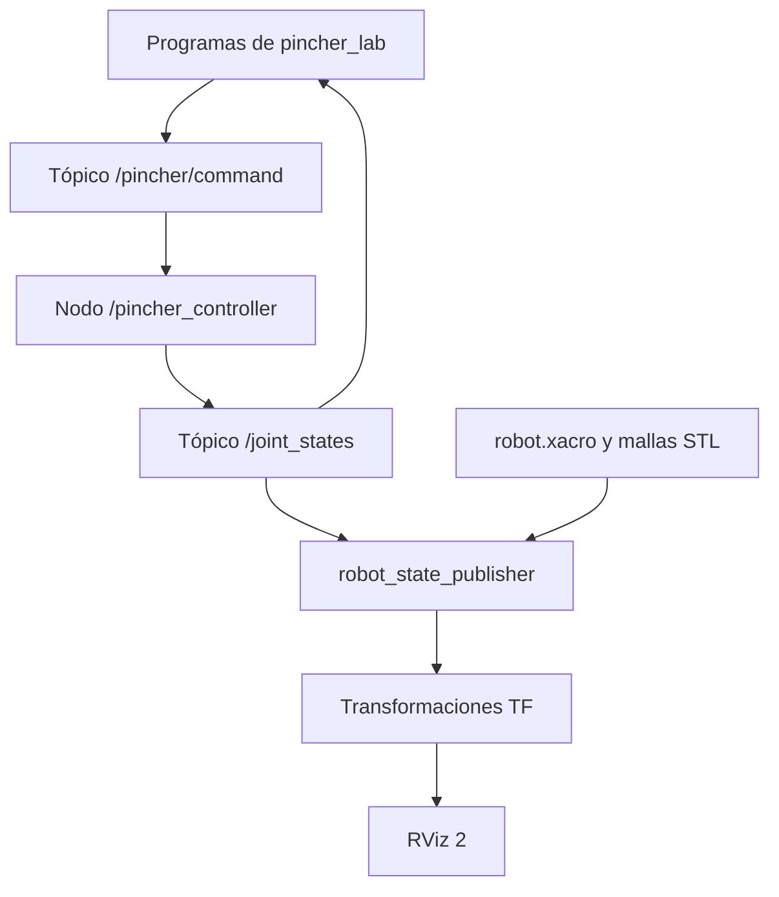

#### Nodos principales

| Nodo | Función |
| --- | --- |
| `/pincher_controller` | Recibir comandos, validar el perfil articular y publicar estados. |
| `/pincher_gui` | Enviar posiciones, velocidad, HOME, torque y parada de software. |
| `/robot_state_publisher` | Publicar las transformaciones del modelo Xacro. |
| `/rviz2` | Visualizar el robot, los marcos coordenados y sus movimientos. |

#### Tópicos principales

| Tópico | Tipo | Publicador | Suscriptor | Función |
| --- | --- | --- | --- | --- |
| `/pincher/command` | `sensor_msgs/msg/JointState` | Programas y GUI | `/pincher_controller` | Enviar objetivos articulares. |
| `/joint_states` | `sensor_msgs/msg/JointState` | `/pincher_controller` | Programas y `robot_state_publisher` | Reportar posiciones articulares. |
| `/pincher/status` | `std_msgs/msg/String` | `/pincher_controller` | GUI | Informar el estado del controlador. |
| `/pincher/profile_velocity` | `std_msgs/msg/UInt32` | GUI | `/pincher_controller` | Modificar la velocidad configurada. |

#### Servicios disponibles

| Servicio | Tipo | Función |
| --- | --- | --- |
| `/pincher/home` | `std_srvs/srv/Trigger` | Regresar a la posición de referencia. |
| `/pincher/software_stop` | `std_srvs/srv/Trigger` | Activar la parada de software. |
| `/pincher/torque_enable` | `std_srvs/srv/SetBool` | Habilitar o deshabilitar el torque. |

### Estructura del repositorio

```text
Laboratorio5/
├── README.md
├── pincher_control/
│   ├── config/
│   │   ├── ax12a.yaml
│   │   └── xl430.yaml
│   ├── launch/
│   │   └── pincher_system.launch.py
│   ├── pincher_control/
│   │   ├── control_servo.py
│   │   ├── dynamixel_profiles.py
│   │   ├── pincher_gui.py
│   │   └── scan_dynamixel.py
│   ├── package.xml
│   ├── setup.cfg
│   └── setup.py
├── pincher_description/
│   ├── launch/
│   │   ├── display.launch.py
│   │   └── display_gui.launch.py
│   ├── meshes/
│   ├── rviz/
│   │   └── pincher.rviz
│   ├── urdf/
│   │   └── robot.xacro
│   ├── package.xml
│   ├── setup.cfg
│   └── setup.py
├── pincher_lab/
│   ├── actividad04_individual.py
│   ├── actividad07_simultaneo.py
│   ├── actividad08_secuencial.py
│   ├── actividad09_interpolacion.py
│   ├── actividad10_sinusoidal.py
│   ├── actividad11_fk.py
│   ├── actividad12_ik.py
│   ├── actividad14_trazado.py
│   ├── actividad15_coreografia.py
│   ├── pincher_lab_utils.py
│   ├── poses_coreografia.yaml
│   └── guion.yaml
├── P9.png
├── P10_1.png
├── P10_2.png
├── P10_3.png
├── P10_4.png
├── P11.png
└── P12.png
```

Las carpetas `build`, `install`, `log` y `__pycache__`, junto con los archivos `.pyc`, no deben incluirse en el repositorio.

### Compilación y ejecución

Ubique `pincher_control` y `pincher_description` dentro de la carpeta `src` de un espacio de trabajo ROS 2. La carpeta `pincher_lab` puede permanecer dentro del repositorio del laboratorio.

```bash
source /opt/ros/jazzy/setup.bash
cd ~/ros2_ws
rosdep install --from-paths src --ignore-src -r -y
colcon build --symlink-install
source install/setup.bash
```

El sistema completo se inicia en modo simulado mediante:

```bash
ros2 launch pincher_control pincher_system.launch.py \
  use_hardware:=false \
  use_meshes:=true \
  start_gui:=true \
  start_rviz:=true
```

En otra terminal:

```bash
source /opt/ros/jazzy/setup.bash
source ~/ros2_ws/install/setup.bash
cd ~/ros2_ws/src/Laboratorio5/pincher_lab
python3 actividad04_individual.py
```

El último comando se reemplaza por el programa de la actividad que se desee ejecutar.

### Condiciones de operación

- El robot inicia y finaliza cada prueba en HOME.
- Los comandos se validan antes de publicarse.
- Los movimientos de gran amplitud utilizan interpolación.
- La simulación se ejecuta con `use_hardware:=false`.
- Las cinco articulaciones se expresan en radianes dentro de ROS 2.
- Los valores suministrados en grados se convierten antes de publicarse.
- La parada de software está disponible mediante el servicio `/pincher/software_stop`.

---

### Actividad 1. Preparación virtual del robot

La preparación se realizó sobre el modelo virtual. El archivo `pincher_system.launch.py` inicia:

1. El modelo Xacro.
2. `robot_state_publisher`.
3. RViz 2.
4. El controlador `pincher_controller`.
5. La interfaz gráfica opcional.

La correspondencia entre la postura comandada y el modelo se verifica observando `/joint_states` y las transformaciones TF. La configuración inicial segura es HOME.

El modelo también puede examinarse de forma independiente mediante:

```bash
ros2 launch pincher_description display_gui.launch.py use_meshes:=true
```

### Actividad 2. Identificación de motores y articulaciones

Los archivos de configuración definen cinco servomotores con ID consecutivos. En el perfil XL430, la referencia central es 2048 unidades; en el AX-12A es 512. Ambas referencias equivalen a cero radianes.

| Articulación | Nombre ROS 2 | ID | Referencia | Signo configurado | Función |
| --- | --- | ---: | --- | ---: | --- |
| Base | `waist` | 1 | 0 rad | +1 | Orientar el brazo alrededor del eje vertical. |
| Hombro | `shoulder` | 2 | 0 rad | -1 | Elevar o descender el primer eslabón. |
| Codo | `elbow` | 3 | 0 rad | -1 | Flexionar o extender el brazo. |
| Muñeca | `wrist` | 4 | 0 rad | -1 | Ajustar la orientación de la herramienta. |
| Pinza | `gripper` | 5 | 0 rad | +1 | Abrir o cerrar los dedos mediante articulaciones imitadoras. |

El sentido positivo de cada coordenada articular se interpreta mediante la regla de la mano derecha alrededor del eje local definido en el Xacro. La lista `joint_signs` relaciona ese sentido con el giro interno de cada servomotor.

### Actividad 3. Geometría del robot

La geometría se obtuvo del archivo `robot.xacro` y de las mallas STL utilizadas por RViz.

#### Distancias entre ejes

| Parámetro geométrico | Valor |
| --- | ---: |
| Altura del eje de la cintura respecto a `world` | 0.04495 m |
| Distancia vertical cintura-hombro | 0.04450 m |
| Altura acumulada hasta el hombro | 0.08945 m |
| Desplazamiento del hombro | \(L_m=0.03150\ \text{m}\) |
| Proyección principal del primer eslabón | \(L_2=0.10100\ \text{m}\) |
| Longitud efectiva hombro-codo | \(L_r=\sqrt{L_2^2+L_m^2}=0.10580\ \text{m}\) |
| Distancia codo-muñeca | \(L_3=0.10100\ \text{m}\) |
| Distancia visual muñeca-`gripper_bar` | 0.11900 m |
| Distancia analítica muñeca-TCP usada por la IK | 0.12915 m |

La distancia final depende del marco seleccionado. El Xacro ubica el marco visual `gripper_bar` a 0.119 m de la muñeca, mientras el modelo analítico utiliza un TCP a 0.12915 m. Por esta razón, las comparaciones deben realizarse siempre sobre el mismo marco.

#### Dimensiones principales de la pinza

Las siguientes dimensiones corresponden a las cajas envolventes de las mallas STL, antes de aplicar las transformaciones del Xacro.

| Componente | Dimensiones aproximadas |
| --- | --- |
| Cuerpo de la pinza | 44.000 × 66.449 × 46.700 mm |
| Mecanismo de accionamiento | 20.499 × 5.000 × 36.490 mm |
| Barra de la pinza | 103.488 × 28.000 × 49.250 mm |
| Cada dedo | 55.300 × 16.047 × 29.000 mm |

#### Esquema geométrico

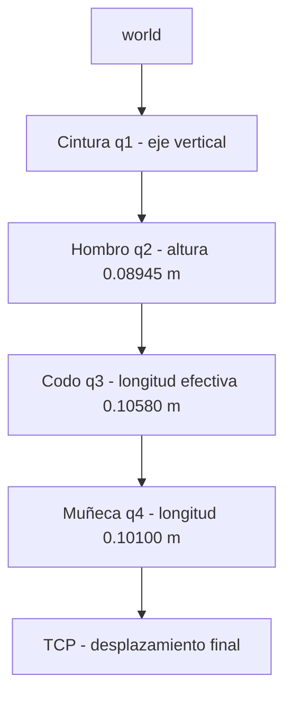

### Actividad 4. Movimiento individual de articulaciones

El archivo [`actividad04_individual.py`](./pincher_lab/actividad04_individual.py) implementa dos modos:

1. Selección manual de una articulación y un ángulo en grados.
2. Prueba automática de todas las articulaciones.

La prueba automática utiliza:

```text
[20°, -20°, 35°]
```

Cada articulación se mueve de manera independiente a las tres posiciones y regresa a HOME antes de continuar con la siguiente. Para la pinza se aplica un factor de escala de 0.4, según el mapeo usado por la visualización.

### Actividad 6. Determinación de límites seguros

Los límites se tomaron del modelo Xacro y se implementaron en `pincher_lab_utils.py` y `pincher_gui.py`.

| Articulación | Límite inferior | Límite superior | Criterio de seguridad |
| --- | ---: | ---: | --- |
| Base | -150° | 150° | Límite del modelo y validación de software. |
| Hombro | -150° | 150° | Límite del modelo y validación de software. |
| Codo | -150° | 150° | Límite del modelo y validación de software. |
| Muñeca | -150° | 150° | Límite del modelo y validación de software. |
| Pinza | -90° | 90° | Límite del modelo y articulaciones imitadoras. |

Al intentar enviar un objetivo exterior al intervalo permitido, `PincherLab.send()` genera un error y evita la publicación. Al tratarse de una simulación, estos límites corresponden al margen operativo definido por el modelo y no a una medición de topes físicos.

### Actividad 7. Movimiento simultáneo

El archivo [`actividad07_simultaneo.py`](./pincher_lab/actividad07_simultaneo.py) convierte las configuraciones de grados a radianes y publica las cinco articulaciones dentro de un único mensaje `JointState`.

| Configuración | Base | Hombro | Codo | Muñeca | Pinza |
| ---: | ---: | ---: | ---: | ---: | ---: |
| 1 | 0° | 0° | 0° | 0° | 0° |
| 2 | 25° | 25° | 20° | -20° | 0° |
| 3 | -35° | 35° | -30° | 30° | 0° |
| 4 | 85° | -20° | 55° | 25° | 0° |
| 5 | 80° | -35° | 55° | -45° | 0° |

Después de completar las configuraciones, el programa agrega un último comando HOME.

### Actividad 8. Movimiento secuencial

El archivo [`actividad08_secuencial.py`](./pincher_lab/actividad08_secuencial.py) utiliza la configuración 2:

```text
[25°, 25°, 20°, -20°, 0°]
```

Las articulaciones se actualizan en el orden:

1. Base.
2. Hombro.
3. Codo.
4. Muñeca.
5. Pinza.

| Criterio | Movimiento simultáneo | Movimiento secuencial |
| --- | --- | --- |
| Tiempo programado | Aproximadamente 2 s por configuración. | Aproximadamente 7.5 s para las cinco articulaciones. |
| Trayectoria del TCP | Cambian todas las coordenadas articulares a la vez. | Se forma una trayectoria por segmentos al mover una articulación por etapa. |
| Suavidad observada | Movimiento coordinado entre articulaciones. | Presenta cambios de dirección entre etapas. |
| Uso principal | Alcanzar una configuración completa. | Visualizar el efecto individual de cada articulación. |

### Actividad 9. Interpolación de trayectorias

El archivo [`actividad09_interpolacion.py`](./pincher_lab/actividad09_interpolacion.py) desplaza simultáneamente las articulaciones entre:

```text
qi = [0.0, 0.0, 0.0, 0.0, 0.0] rad
qf = [1.2, -0.8, 0.9, 0.5, 0.3] rad
```

Cada tramo dura 3 s y se evalúa a 50 Hz.

#### Interpolación lineal

Sea:

$$
\tau=\frac{t}{T}, \qquad 0\leq \tau\leq 1
$$

La trayectoria lineal se calcula mediante:

$$
q(t)=q_i+\tau(q_f-q_i)
$$

Este método mantiene velocidad constante durante el recorrido, pero presenta cambios abruptos de velocidad al inicio y al final.

#### Interpolación quíntica

La función de mezcla utilizada es:

$$
s(\tau)=10\tau^3-15\tau^4+6\tau^5
$$

Por tanto:

$$
q(t)=q_i+s(\tau)(q_f-q_i)
$$

La interpolación quíntica garantiza velocidad y aceleración nulas en los extremos. En la prueba, el movimiento de ida utiliza interpolación lineal y el regreso a HOME utiliza interpolación quíntica.

<div align="center">
  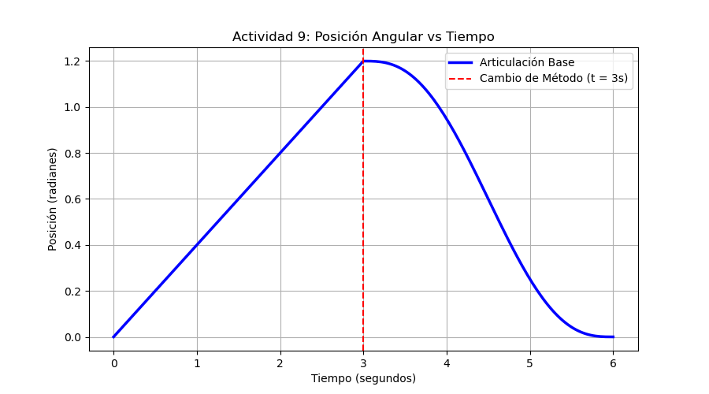
</div>

<p align="center"><em>Figura 1. Movimiento lineal de ida y retorno quíntico de la articulación de la base.</em></p>

La curva lineal alcanza 1.2 rad en \(t=3\ \text{s}\). A partir de ese instante comienza el retorno quíntico, cuya pendiente inicia y finaliza suavemente.

### Actividad 10. Trayectoria sinusoidal de una articulación

El archivo [`actividad10_sinusoidal.py`](./pincher_lab/actividad10_sinusoidal.py) controla la articulación de la muñeca mediante:

$$
q(t)=q_0+A\sin(2\pi ft)
$$

con:

$$
q_0=0\ \text{rad}
$$

Cada prueba dura 10 s y se ejecuta a 50 Hz.

| Prueba | Amplitud \(A\) | Frecuencia \(f\) |
| ---: | ---: | ---: |
| 1 | 0.2 rad | 0.1 Hz |
| 2 | 0.2 rad | 0.3 Hz |
| 3 | 0.4 rad | 0.1 Hz |
| 4 | 0.4 rad | 0.3 Hz |

El error instantáneo se define como:

$$
e(t)=q_{\mathrm{deseado}}(t)-q_{\mathrm{reportado}}(t)
$$

El error máximo y la raíz del error cuadrático medio se calculan con:

$$
e_{\max}=\max |e(t)|
$$

$$
\operatorname{RMSE}=
\sqrt{\frac{1}{N}\sum_{k=1}^{N}e_k^2}
$$

En modo sin hardware, `pincher_controller` actualiza el estado simulado inmediatamente después de recibir cada comando. Por esta razón, la posición deseada y la posición reportada prácticamente se superponen, y los errores impresos con cuatro cifras decimales son cercanos a cero.

<table>
  <tr>
    <td align="center">
      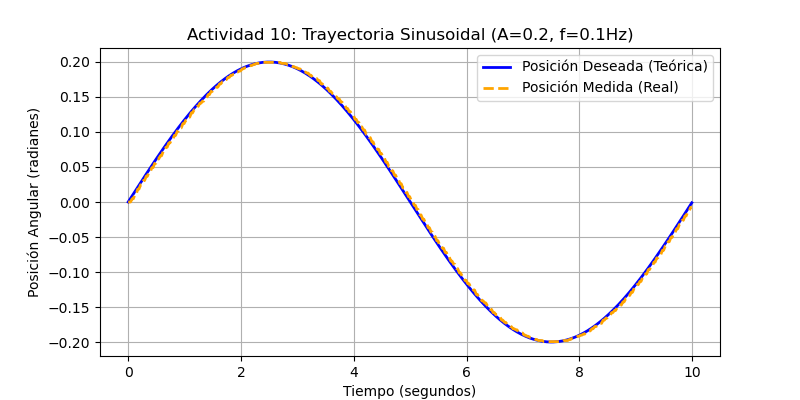<br>
      <em>Figura 2. A = 0.2 rad, f = 0.1 Hz.</em>
    </td>
    <td align="center">
      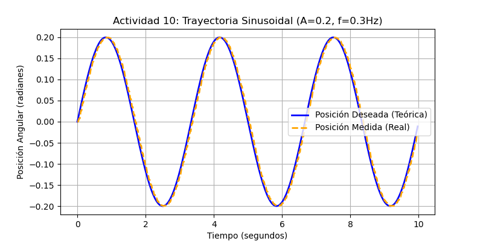<br>
      <em>Figura 3. A = 0.2 rad, f = 0.3 Hz.</em>
    </td>
  </tr>
  <tr>
    <td align="center">
      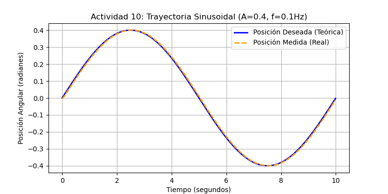<br>
      <em>Figura 4. A = 0.4 rad, f = 0.1 Hz.</em>
    </td>
    <td align="center">
      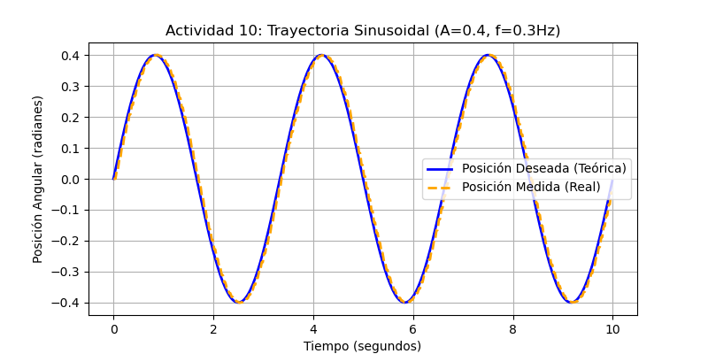<br>
      <em>Figura 5. A = 0.4 rad, f = 0.3 Hz.</em>
    </td>
  </tr>
</table>

Las leyendas “posición medida” de las figuras corresponden al estado publicado por la simulación y no a una medición física de los servomotores.

### Actividad 11. Cinemática directa

El archivo [`actividad11_fk.py`](./pincher_lab/actividad11_fk.py) recibe:

$$
q_1,\ q_2,\ q_3,\ q_4
$$

y calcula:

$$
x,\ y,\ z,\ \text{roll},\ \text{pitch},\ \text{yaw}
$$

#### Modelo DH equivalente

Después de incorporar los desplazamientos fijos del Xacro dentro de las referencias articulares, el manipulador puede representarse mediante el siguiente modelo equivalente:

| \(i\) | Elemento | \(\theta_i\) | \(d_i\) | \(a_i\) | \(\alpha_i\) |
| ---: | --- | ---: | ---: | ---: | ---: |
| 1 | Base | \(q_1\) | \(0.08945\) | \(0\) | \(\pi/2\) |
| 2 | Hombro | \(q_2\) | \(0\) | \(L_r\) | \(0\) |
| 3 | Codo | \(q_3\) | \(0\) | \(L_3\) | \(0\) |
| 4 | Muñeca | \(q_4\) | \(0\) | \(0\) | \(0\) |
| 5 | TCP fijo | \(0\) | \(0\) | \(L_4\) | \(0\) |

Para el modelo analítico:

$$
L_r=0.10595\ \text{m},\qquad
L_3=0.10000\ \text{m},\qquad
L_4=0.12915\ \text{m}
$$

La posición del centro de la muñeca utilizada por `actividad11_fk.py` se obtiene con:

$$
\rho =
0.10595\cos q_2+
0.10000\cos(q_2+q_3)
$$

$$
x_w=\rho\cos q_1
$$

$$
y_w=\rho\sin q_1
$$

$$
z_w=
0.08945+
0.10595\sin q_2+
0.10000\sin(q_2+q_3)
$$

La orientación depende de:

$$
q_{234}=q_2+q_3+q_4
$$

y se calcula en el programa mediante:

$$
\text{roll}=
\operatorname{atan2}\left(0,-\cos q_{234}\right)
$$

$$
\text{pitch}=
\operatorname{atan2}
\left(
-\sin q_{234},
\sqrt{
(\cos q_1\cos q_{234})^2+
(\sin q_1\cos q_{234})^2
}
\right)
$$

$$
\text{yaw}=
\operatorname{atan2}
\left(
\sin q_1\cos q_{234},
\cos q_1\cos q_{234}
\right)
$$

La fila del TCP representa una transformación fija posterior a la muñeca. En la ejecución de `actividad11_fk.py`, los valores \(x\), \(y\) y \(z\) se reportan en el centro de la muñeca; por ello \(q_4\) modifica la orientación, pero no esas tres coordenadas. Para comparar con un marco terminal de RViz se debe aplicar además la transformación fija correspondiente al TCP seleccionado.

#### Resultados

| Configuración | \(x\) (m) | \(y\) (m) | \(z\) (m) | Roll (rad) | Pitch (rad) | Yaw (rad) |
| ---: | ---: | ---: | ---: | ---: | ---: | ---: |
| 1 | 0.2060 | 0.0000 | 0.0895 | 3.1416 | 0.0000 | 0.0000 |
| 2 | 0.1511 | 0.0705 | 0.2049 | 3.1416 | -0.4363 | 0.4363 |
| 3 | 0.1527 | -0.1069 | 0.1589 | 3.1416 | -0.6109 | -0.6109 |
| 4 | 0.0158 | 0.1808 | 0.1106 | 3.1416 | -1.0472 | 1.4835 |
| 5 | 0.0314 | 0.1780 | 0.0629 | 3.1416 | 0.4363 | 1.3963 |

<div align="center">
  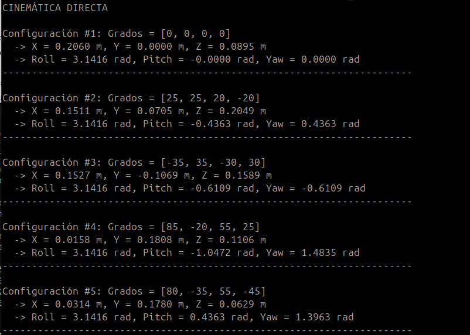
</div>

<p align="center"><em>Figura 6. Resultados calculados por el programa de cinemática directa.</em></p>

Para la configuración 2:

$$
\operatorname{atan2}(y,x)
=
\operatorname{atan2}(0.0705,0.1511)
\approx25^\circ
$$

El ángulo coincide con la orientación horizontal observada en RViz. Las diferencias de distancia aparecen cuando se comparan el centro de la muñeca y el marco `gripper_bar`, por lo que la validación debe conservar el mismo marco en ambos modelos.

### Actividad 12. Cinemática inversa

El archivo [`actividad12_ik.py`](./pincher_lab/actividad12_ik.py) recibe:

$$
x_T,\ y_T,\ z_T,\ \theta
$$

Los parámetros del modelo analítico implementado son:

$$
L_1=0.08945\ \text{m},\quad
L_2=0.10000\ \text{m},\quad
L_m=0.03500\ \text{m},\quad
L_3=0.10000\ \text{m},\quad
L_4=0.12915\ \text{m}
$$

#### Ángulo de la base

$$
q_1=\operatorname{atan2}(y_T,x_T)
$$

#### Desacople de muñeca

El vector de aproximación de la herramienta es:

$$
\mathbf{a}=
\begin{bmatrix}
\sin\theta\cos q_1\\
\sin\theta\sin q_1\\
\cos\theta
\end{bmatrix}
$$

La posición del centro de la muñeca se calcula mediante:

$$
\mathbf{p}_w=
\begin{bmatrix}
x_T\\y_T\\z_T
\end{bmatrix}
-L_4\mathbf{a}
$$

Por componentes:

$$
x_w=x_T-L_4\sin\theta\cos q_1
$$

$$
y_w=y_T-L_4\sin\theta\sin q_1
$$

$$
z_w=z_T-L_4\cos\theta
$$

#### Reducción a un mecanismo 2R

$$
r=\sqrt{x_w^2+y_w^2}
$$

$$
h=z_w-L_1
$$

$$
c=\sqrt{r^2+h^2}
$$

con:

$$
L_r=\sqrt{L_2^2+L_m^2}
$$

$$
\beta=\operatorname{atan2}(L_m,L_2)
$$

$$
\psi=\frac{\pi}{2}-\beta
$$

El punto es geométricamente alcanzable si:

$$
|L_r-L_3|\leq c\leq L_r+L_3
$$

Los ángulos auxiliares son:

$$
\phi=
\arccos
\left(
\frac{L_r^2+L_3^2-c^2}{2L_rL_3}
\right)
$$

$$
\alpha=
\arccos
\left(
\frac{L_r^2+c^2-L_3^2}{2L_rc}
\right)
$$

$$
\gamma=\operatorname{atan2}(h,r)
$$

#### Solución de codo arriba

$$
q_{2a}=
\frac{\pi}{2}-\beta-\alpha-\gamma
$$

$$
q_{3a}=
\pi-\psi-\phi
$$

$$
q_{4a}=
\theta-q_{2a}-q_{3a}-\frac{\pi}{2}
$$

#### Solución de codo abajo

$$
q_{2b}=
\frac{\pi}{2}-(\gamma-\alpha+\beta)
$$

$$
q_{3b}=
-\pi+(\phi-\psi)
$$

$$
q_{4b}=
\theta-q_{2b}-q_{3b}-\frac{\pi}{2}
$$

Los ángulos se normalizan al intervalo \([-\pi,\pi)\). Después se descartan las configuraciones que incumplen los límites y, si ambas son válidas, se elige la más cercana a la postura actual:

$$
q^*=
\underset{q\in\{q_a,q_b\}}{\operatorname{argmin}}
\left\|q-q_{\mathrm{actual}}\right\|_2
$$

#### Pruebas cartesianas

| Objetivo \((x,y,z,\theta)\) | Resultado |
| --- | --- |
| \((0.15,0.05,0.15,0.3)\) | Ambas soluciones fuera de límites articulares. |
| \((0.20,0.00,0.10,0.5)\) | Codo arriba; validación geométrica igual a cero. |
| \((0.05,0.15,0.20,-0.2)\) | Codo arriba; validación geométrica igual a cero. |
| \((0.12,-0.06,0.14,0.1)\) | Ambas soluciones fuera de límites articulares. |
| \((0.40,0.40,0.40,0.0)\) | Punto fuera del espacio de trabajo. |

<div align="center">
  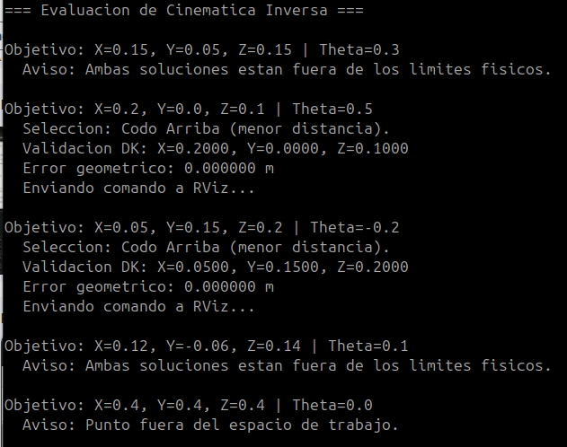
</div>

<p align="center"><em>Figura 7. Selección, validación y descarte de soluciones de cinemática inversa.</em></p>

### Actividad 14. Trazado virtual de una figura

El archivo [`actividad14_trazado.py`](./pincher_lab/actividad14_trazado.py) define un cuadrado de 60 mm por 60 mm mediante cinco puntos cartesianos. Cada punto se resuelve con la cinemática inversa de la Actividad 12.

| Punto | \(x\) (m) | \(y\) (m) | \(z\) (m) | \(\theta\) (rad) |
| ---: | ---: | ---: | ---: | ---: |
| 1 | 0.15 | -0.03 | 0.05 | 1.5708 |
| 2 | 0.21 | -0.03 | 0.05 | 1.5708 |
| 3 | 0.21 | 0.03 | 0.05 | 1.5708 |
| 4 | 0.15 | 0.03 | 0.05 | 1.5708 |
| 5 | 0.15 | -0.03 | 0.05 | 1.5708 |

Para cada objetivo:

1. Se calculan las soluciones de codo arriba y codo abajo.
2. Se descartan las que incumplen los límites.
3. Se selecciona la más cercana a la configuración actual.
4. Se interpola en el espacio articular mediante una trayectoria quíntica de 1.5 s.
5. Al cerrar el cuadrado, el robot regresa a HOME mediante otra interpolación quíntica.

### Actividad 15. Reto final: coreografía robótica

La coreografía se implementa mediante:

- [`actividad15_coreografia.py`](./pincher_lab/actividad15_coreografia.py): ejecutor de la secuencia.
- [`poses_coreografia.yaml`](./pincher_lab/poses_coreografia.yaml): configuraciones articulares.
- [`guion.yaml`](./pincher_lab/guion.yaml): tiempos, poses y duración de cada transición.

El archivo de poses contiene:

| Grupo | Poses |
| --- | --- |
| Seguridad | `neutro` |
| Secuencia izquierda-derecha | `u_izq_alta`, `u_izq_baja`, `u_der_baja`, `u_der_alta` |
| Movimientos altos | `alto_izq`, `alto_der` |
| Movimiento de la herramienta | `pinza_abre`, `pinza_cierra` |

El guion contiene 66 eventos sincronizados y una duración aproximada de 88 s. El programa:

1. Interpola desde la postura actual hasta `neutro`.
2. Espera el instante indicado por cada evento.
3. Ejecuta la transición mediante interpolación quíntica.
4. Utiliza base, hombro, codo, muñeca y pinza.
5. Finaliza nuevamente en `neutro`.

La secuencia supera el mínimo de 45 s y se ejecuta sin intervención manual después de iniciada.

## b) Diagrama de flujo

El siguiente diagrama representa la secuencia general del laboratorio y puede editarse directamente desde el código Markdown.

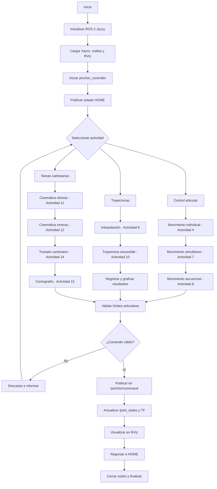

## c) Código fuente

El código completo se encuentra distribuido en los tres componentes del repositorio. Los archivos principales son:

### Paquete de control

| Archivo | Función |
| --- | --- |
| [`control_servo.py`](./pincher_control/pincher_control/control_servo.py) | Controlador articular en modo virtual o físico. |
| [`pincher_gui.py`](./pincher_control/pincher_control/pincher_gui.py) | Interfaz de control y seguridad. |
| [`dynamixel_profiles.py`](./pincher_control/pincher_control/dynamixel_profiles.py) | Perfiles AX-12A y XL430-W250. |
| [`scan_dynamixel.py`](./pincher_control/pincher_control/scan_dynamixel.py) | Herramienta opcional de detección de motores físicos. |
| [`pincher_system.launch.py`](./pincher_control/launch/pincher_system.launch.py) | Lanzamiento integrado del sistema. |

### Paquete de descripción

| Archivo | Función |
| --- | --- |
| [`robot.xacro`](./pincher_description/urdf/robot.xacro) | Geometría, articulaciones, límites y mallas. |
| [`display.launch.py`](./pincher_description/launch/display.launch.py) | Visualización conectada con el controlador. |
| [`display_gui.launch.py`](./pincher_description/launch/display_gui.launch.py) | Inspección manual mediante `joint_state_publisher_gui`. |
| [`pincher.rviz`](./pincher_description/rviz/pincher.rviz) | Configuración de RViz 2. |

### Programas del laboratorio

| Actividad | Archivo |
| ---: | --- |
| 4 | [`actividad04_individual.py`](./pincher_lab/actividad04_individual.py) |
| 7 | [`actividad07_simultaneo.py`](./pincher_lab/actividad07_simultaneo.py) |
| 8 | [`actividad08_secuencial.py`](./pincher_lab/actividad08_secuencial.py) |
| 9 | [`actividad09_interpolacion.py`](./pincher_lab/actividad09_interpolacion.py) |
| 10 | [`actividad10_sinusoidal.py`](./pincher_lab/actividad10_sinusoidal.py) |
| 11 | [`actividad11_fk.py`](./pincher_lab/actividad11_fk.py) |
| 12 | [`actividad12_ik.py`](./pincher_lab/actividad12_ik.py) |
| 14 | [`actividad14_trazado.py`](./pincher_lab/actividad14_trazado.py) |
| 15 | [`actividad15_coreografia.py`](./pincher_lab/actividad15_coreografia.py) |
| Utilidades | [`pincher_lab_utils.py`](./pincher_lab/pincher_lab_utils.py) |

### Exclusiones del repositorio

Se recomienda utilizar el siguiente contenido en `.gitignore`:

```gitignore
build/
install/
log/
__pycache__/
*.pyc
*.pyo
.pytest_cache/
.vscode/
.idea/
```

## d) Plano de planta virtual

El marco fijo de RViz es `world` y el robot se ubica en el origen. La cuadrícula representa el plano \(XY\). La figura de la Actividad 14 se traza en el plano horizontal:

$$
z=0.05\ \text{m}
$$

con orientación constante:

$$
\theta=\frac{\pi}{2}
$$

La planta de la trayectoria es:

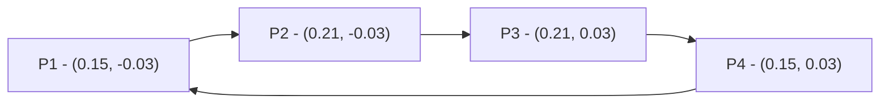

La base del robot permanece en \((0,0)\), mientras el cuadrado ocupa:

$$
0.15\leq x\leq0.21\ \text{m}
$$

$$
-0.03\leq y\leq0.03\ \text{m}
$$

## e) Evidencia de funcionamiento

Durante la simulación se verificó:

- Movimiento independiente de las cinco articulaciones.
- Ejecución automática de tres posiciones por articulación.
- Recorrido de las cinco configuraciones simultáneas.
- Movimiento secuencial de la configuración 2.
- Interpolación lineal y quíntica.
- Cuatro trayectorias sinusoidales.
- Cálculo de cinemática directa para las cinco configuraciones.
- Soluciones de cinemática inversa con codo arriba y codo abajo.
- Descarte por límites y por espacio de trabajo.
- Trazado cartesiano de un cuadrado.
- Coreografía automática superior a 45 s.
- Inicio y finalización en una posición segura.

Las Figuras 1 a 7 presentan las salidas numéricas y gráficas. La ejecución completa en RViz se encuentra en el video explicativo de la última sección.

## f) Conclusiones individuales

### Pablo de Jesús Arcila Mora

El laboratorio permitió integrar el modelo geométrico del robot con la comunicación de ROS 2 y la visualización en RViz. La separación entre descripción, control y programas de aplicación facilitó probar cada estrategia de movimiento de forma independiente y mantener una posición segura al comenzar y finalizar las pruebas.

### Marco Alejandro Morales Pantoja

El desarrollo de las cinemáticas mostró la importancia de utilizar el mismo sistema coordenado y el mismo TCP al comparar resultados analíticos con RViz. El desacople de muñeca permitió obtener las soluciones de codo arriba y codo abajo, filtrar configuraciones por límites y detectar objetivos fuera del espacio de trabajo.

### Daniel Felipe Castro Galindo

La comparación entre movimientos simultáneos, secuenciales e interpolados evidenció que la forma de construir una trayectoria modifica el tiempo, la suavidad y el recorrido del TCP. La interpolación quíntica resultó adecuada para el trazado y la coreografía debido a su comportamiento suave en los extremos.

## g) Referencias

- LabSIR, Universidad Nacional de Colombia. [Visualización y control del Phantom X Pincher X100 en ROS 2 Jazzy](https://github.com/labsir-un/06_Rob_2026_I_ROS2_Jazzy_PhantomX100_RVIZ).
- LabSIR, Universidad Nacional de Colombia. [Kit Phantom X Pincher para ROS 2](https://github.com/labsir-un/KIT_Phantom_X_Pincher_ROS2).
- LabSIR, Universidad Nacional de Colombia. [Modelos tridimensionales del Phantom X Pincher X100](https://github.com/labsir-un/3DModels_KIT_Phantom_Pincher_X100).
- [PincherX 100: inverse kinematics and simple path planning](https://github.com/cychitivav/px100_ikine).

## h) Video explicativo

En el video se presenta el funcionamiento de las actividades desarrolladas, la ejecución de los programas en ROS 2 Jazzy, los resultados de cinemática directa e inversa, el trazado virtual y la coreografía robótica.

<div align="center">
  <a href="https://www.youtube.com/watch?v=hjCt5STNxuI">
    
  </a>
</div>

<p align="center">
  <a href="https://www.youtube.com/watch?v=hjCt5STNxuI">
    Ver video completo en YouTube
  </a>
</p>
