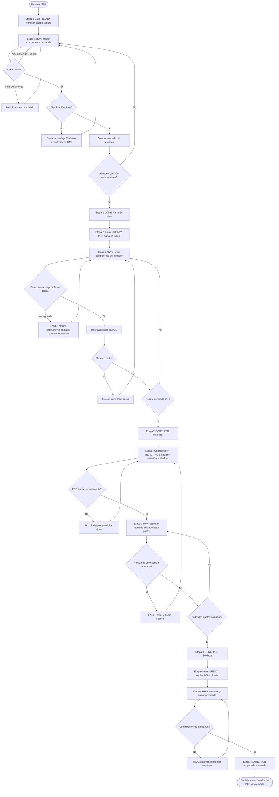
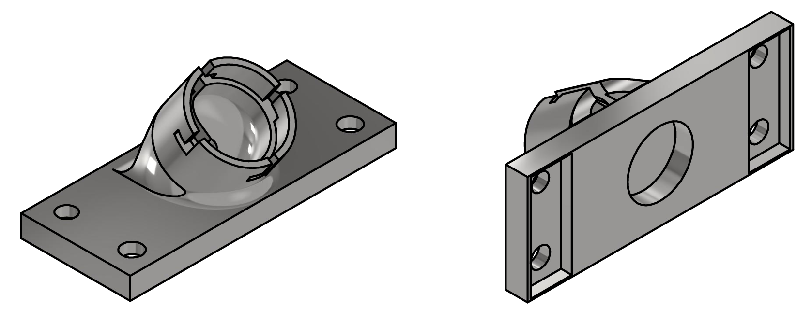
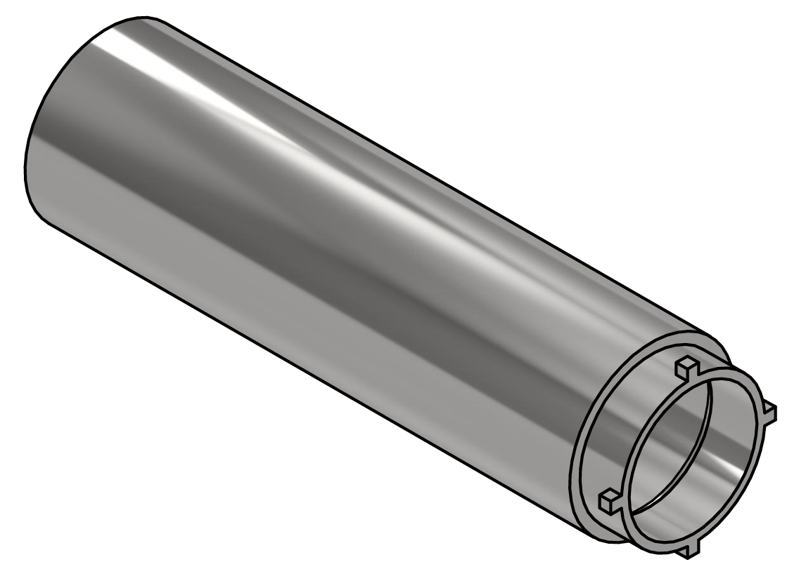
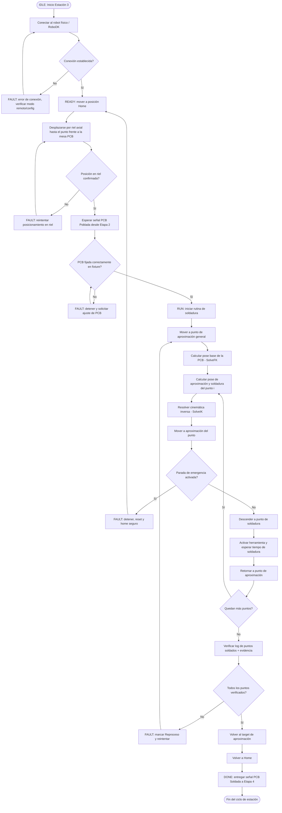

<div align="center">
  <picture>
    <source srcset="https://imgur.com/5bYAzsb.png" media="(prefers-color-scheme: dark)">
    <source srcset="https://imgur.com/Os03JoE.png" media="(prefers-color-scheme: light)">
    
  </picture>

  <h1>Proyecto Final- Robótica Industrial</h1>
  <h2>Automatización del Proceso de Ensamblaje, Soldadura y Empaque de PCBs.</h2>

  <p>
    <strong>Robótica - 2026-I</strong><br>
    Ingeniería Mecatrónica<br>
    Facultad de Ingeniería<br>
    Universidad Nacional de Colombia
  </p>
</div>


## Integrantes

* **Pablo de Jesus Arcila Mora**
* **Marco Alejandro Morales Pantoja**
* **Daniel Felipe Castro Galindo**
* **Juan ... ... ...**
* **Alejandra ... ... ...**

  
## 1. Bitácora del desarrollo

## 2. Diagrama de flujo del proceso global y por estación




## 3.Diseño del gripper y del workobject

Para la Etapa 3 del proyecto se diseñó una herramienta terminal para el robot Yaskawa Motoman MH6, denominado **“El Chambeador”**, cuya función es sostener el cautín y permitir la ejecución controlada de los puntos de soldadura sobre la PCB.

La herramienta se dividió en dos componentes principales: una **base de fijación** y un **cuerpo tubular portacautín**. Esta configuración modular facilita la fabricación mediante impresión 3D, el montaje del cautín y el reemplazo independiente de cualquiera de las piezas.



*Figura 1. Base de fijación y sistema de acople de la herramienta.*

La base incorpora los orificios necesarios para su sujeción al sistema de montaje del robot. En su parte frontal se diseñó un alojamiento circular con ranuras que recibe las pestañas del cuerpo portacautín.



*Figura 2. Cuerpo tubular encargado de alojar y sujetar el cautín.*

### Sistema de acople

La unión entre las dos piezas funciona mediante un mecanismo de acople por inserción y giro, similar a un cierre de bayoneta. Para ensamblar la herramienta, las pestañas del cuerpo tubular se alinean con las ranuras de la base, se introduce la pieza y posteriormente se realiza un giro hasta alcanzar la posición de bloqueo.

Este sistema permite montar y desmontar rápidamente el cautín sin retirar toda la base del robot. Además, restringe el desplazamiento axial accidental durante la rutina y ayuda a conservar una posición definida de la herramienta con respecto al TCP programado.

### Compensación axial mediante resorte

Entre el cautín y su superficie de apoyo se instaló un resorte que proporciona **compliancia axial pasiva**. Cuando la punta entra en contacto con el punto de soldadura, el cautín puede desplazarse ligeramente en dirección longitudinal en lugar de transmitir toda la fuerza directamente a la PCB.

Esta solución permite:

- Compensar pequeñas variaciones en la altura o planitud de la PCB.
- Absorber errores menores de posicionamiento y calibración del robot.
- Reducir el riesgo de aplicar una fuerza excesiva sobre las pistas, terminales o componentes.
- Evitar impactos rígidos que puedan deteriorar la punta del cautín.
- Mantener un contacto más uniforme durante el tiempo programado de soldadura.

La rigidez y la precarga del resorte deben ajustarse de manera que exista suficiente fuerza para conservar el contacto térmico, sin producir una carga que pueda deformar o dañar la tarjeta.

### Justificación del diseño

El diseño modular y el sistema de compensación axial permiten utilizar un cautín convencional como herramienta terminal para realizar pruebas de soldadura robotizada. La fabricación aditiva hizo posible obtener rápidamente una geometría adaptada tanto al sistema de montaje del robot como al diámetro del cautín, reduciendo el costo y el tiempo de fabricación del prototipo.

La separación en dos piezas también mejora el acceso durante el ensamblaje y facilita las operaciones de mantenimiento. En caso de desgaste, deformación o cambio del cautín, el cuerpo portacautín puede sustituirse sin fabricar nuevamente la base completa.

### Recomendaciones de uso y mejora

Debido a que la herramienta fue fabricada mediante impresión 3D en material polimérico, se recomienda emplearla principalmente en **pruebas controladas y rutinas de soldadura de corta duración**. La zona frontal, al encontrarse más próxima al elemento calefactor, puede acumular calor y sufrir ablandamiento o deformación progresiva.

Para aumentar la seguridad y la vida útil del sistema se recomienda:

- Evitar el contacto directo entre la parte caliente del cautín y las piezas impresas.
- Incorporar un escudo térmico delgado de acero inoxidable, separado del polímero mediante una cámara de aire.
- Añadir una arandela o buje aislante de mica, cerámica u otro material resistente a altas temperaturas.
- Realizar pausas de enfriamiento entre ciclos prolongados.
- Inspeccionar periódicamente el acople, las pestañas y la zona frontal para detectar deformaciones.
- Para una operación repetitiva o continua, sustituir la sección más cercana al calor por un inserto metálico o fabricar esa zona con un material de mayor resistencia térmica.

Estas mejoras permitirían reducir la transferencia de calor por conducción y radiación hacia las piezas impresas, manteniendo la precisión del montaje y disminuyendo el riesgo de que la herramienta pierda su geometría durante la operación.


## 4. Simulación desde RoboDK

## 5.Código fuente utilizado
Debido a que RoboDK no permite una comunicación en tiempo real de el programa y el robot, la interfaz gráfica no se puede comunicar con el robot en tiempo real. Es por esto que se tienen 2 códigos, uno donde se simula la comunicación real entre la interfaz gráfica y el robot, y el código aplicado en la realidad.
### 5.1 Código con interfaz gráfica
El programa en Python puede consultarse aquí:
[Ver código](src/HMI_Simulacion.py)
### 5.2 Código implementado en el robot real
El programa en Python puede consultarse aquí:
[Ver código](src/Codigo_Implementacio_Robot.py)
## 6. Comparación manual vs automatizado

## 7. Diagrama de flujo de acciones del robot



## 8. Plano de planta de la ubicación de cada uno de los elementos

## 9. Descripción del código implementado para la soldadura

El programa en Python puede consultarse aquí:
[Ver código](src/Codigo_Implementacio_Robot.py)
 
Este programa conecta con el robot físico a través de RoboDK y ejecuta una rutina automática de soldadura sobre una PCB (placas de circuito impreso), calculando cada punto a partir de transformaciones locales respecto a una pose de referencia. A continuación se explican las funciones y parámetros nuevos vistos.
 
### 9.1 Importación de librerías
Además de robolink y robomath (comunicación con RoboDK y funciones matemáticas), se importa la librería time, que permite generar pausas controladas durante la ejecución, por ejemplo mientras el robot se estabiliza en una posición o mientras dura la soldadura.
```python
from robodk.robolink import *
from robodk.robomath import *
import time
```
 
### 9.2 Conexión a RoboDK y al robot físico
Se selecciona el robot desde la estación de RoboDK y se valida que la selección sea correcta con `robot.Valid()`. Después se intenta la conexión con el controlador físico mediante `robot.Connect()` y se confirma el estado con `robot.ConnectedState()` (ambas devuelven `True` o `False`). Si alguna comprobación falla, el programa se detiene lanzando una excepción con un mensaje descriptivo, en lugar de continuar con un robot no disponible.
```python
robot = RDK.ItemUserPick("Selecciona un robot", ITEM_TYPE_ROBOT)
if not robot.Valid():
    raise Exception("No se ha seleccionado un robot válido.")
 
if not robot.Connect():
    raise Exception("No se pudo conectar al robot. Verifica que esté en modo remoto y que la configuración sea correcta.")
 
if not robot.ConnectedState():
    raise Exception("El robot no está conectado correctamente. Revisa la conexión.")
```
 
### 9.3 Parámetros de movimiento y posiciones articulares
Se define la velocidad y la tolerancia (rounding) del movimiento, y se guardan las posiciones clave del robot como arreglos de 6 valores articulares, uno por cada eje: `Home` (posición de reposo), `aprox` (punto de aproximación seguro) y `PCB` (punto de referencia sobre la placa).
```python
robot.setSpeed(50)
robot.setRounding(5)
 
Home  = [0, 0, 0, 0, 0, 0]
aprox = [-88.98, 56.72, 27.52, 4.1, 11.93, 4.62]
PCB   = [-88.02, 62.59, 33.77, 3.8, 11.48, 3.8]
```
 
### 9.4 Parámetros de soldadura
Estas variables configuran la geometría y el tiempo de la rutina: la altura de soldadura, la altura de aproximación (más alta, para evitar colisiones al desplazarse entre puntos), el tiempo que el robot permanece soldando cada punto, el paso entre orificios de la placa (`pitch`, en milímetros) y el número de PCB que se van a procesar en la misma ejecución.
```python
z_soldadura = 4
z_aproximacion = -10
tiempo_soldadura = 10
pitch = 2.54
Numero_de_PCB = 1
```
 
### 9.5 Puntos de soldadura en el plano local de la PCB
Los puntos a soldar se definen como coordenadas (x, y) en el plano local de la placa, expresadas en múltiplos de `pitch`. Esto permite ubicar cada punto según la cuadrícula de orificios de la PCB, sin depender de su posición global dentro de la estación.
```python
puntos_soldadura = [
    (3*pitch, 7*pitch), (4*pitch, 8*pitch), (3*pitch, 9*pitch),
    (4*pitch, 9*pitch), (3*pitch, 8*pitch), (4*pitch, 7*pitch)
]
```
 
### 9.6 Obtención de la pose de referencia (cinemática directa)
El robot se mueve primero al punto de aproximación. Luego, con `SolveFK`, se calcula la pose cartesiana (posición y orientación) correspondiente a las articulaciones descritas en el arreglo  `PCB`, sin necesidad de mover físicamente el robot hasta ese punto. Esta pose (`pose_pcb`) se usa como referencia para ubicar todos los puntos de soldadura.
```python
robot.MoveJ(aprox)
time.sleep(2)
 
pose_pcb = robot.SolveFK(PCB)
```
 
### 9.7 Rutina de soldadura: transformación de puntos y cinemática inversa
Para cada punto de la lista, se calculan dos poses a partir de `pose_pcb` usando `transl(x, y, z)`, que aplica una traslación local sobre esa pose de referencia: una a la altura de aproximación (segura) y otra a la altura de soldadura. Con `SolveIK` se obtienen los valores articulares correspondientes a cada pose, y el robot se desplaza primero al punto de aproximación, desciende al punto de soldadura, espera el tiempo definido en `tiempo_soldadura`, y se retira nuevamente al punto de aproximación antes de continuar con el siguiente punto. Al terminar todos los puntos de una PCB, el robot vuelve al target de aproximación antes de procesar la siguiente placa (si `Numero_de_PCB` > 1).
```python
for j in range(Numero_de_PCB):
    for i, (x, y) in enumerate(puntos_soldadura, start=1):
 
        pose_aprox = pose_pcb * transl(x, y, z_aproximacion)
        pose_sold  = pose_pcb * transl(x, y, z_soldadura)
 
        joints_aprox = robot.SolveIK(pose_aprox)
        joints_sold  = robot.SolveIK(pose_sold)
 
        robot.MoveJ(joints_aprox)
        robot.MoveJ(joints_sold)
        time.sleep(tiempo_soldadura)
        robot.MoveJ(joints_aprox)
 
    robot.MoveJ(aprox)
    time.sleep(3)
```
 
### 9.8 Retorno a posición de home
Una vez completadas todas las PCB configuradas, el robot regresa a la posición de home (todas las articulaciones en 0°) y se imprime un mensaje confirmando que la rutina terminó.
```python
robot.MoveJ(Home)
print("PCB's Completadas")
```

## 10. Descripción del código con interfaz gráfica

## 11. Vídeos de simulación y de implementación 
